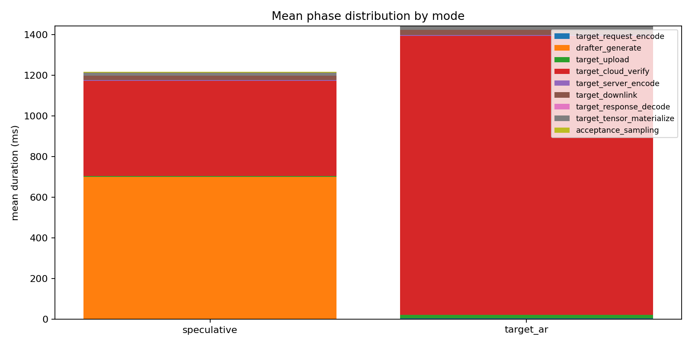
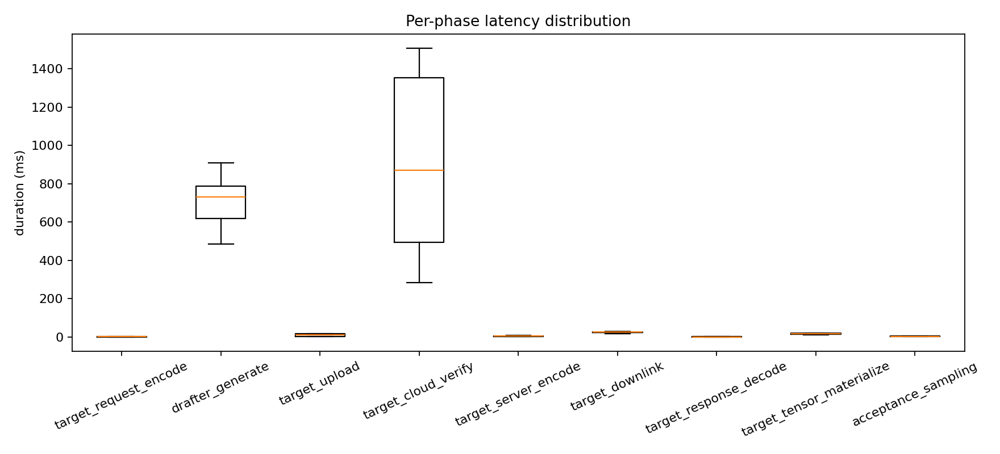
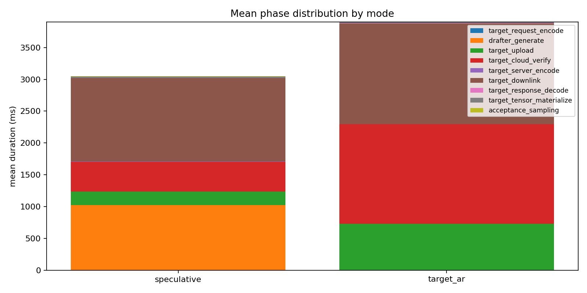
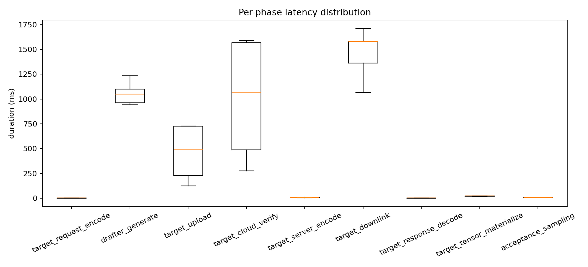

# Binary Logits 下 Speculative Decoding 端云推理时间分布组会汇报

## 1. 汇报目标

本次汇报关注 speculative decoding 推理过程中所有阶段的耗时和占比，重点比较两种 binary logits 协议下的实验场景：

- `binary logits + localhost`：服务端和客户端同机运行，不额外模拟网络。
- `binary logits + 模拟远端`：服务端仍在 localhost，但客户端注入 RTT 和带宽限制，模拟云端 target 服务。

目标是回答三个问题：

1. speculative decoding 每个阶段分别耗时多少、占比多少。
2. 端云通信在 localhost 和模拟远端场景下如何变化。
3. 换成 binary logits 后，speculative 是否仍然优于 target-only baseline。

## 2. 方法实现

### 2.1 系统结构

项目在原始 speculative decoding 实现上增加了端云拆分和 profiling：

- `serve_target.py`：云端 target model 服务，提供 `/health`、`/metadata`、`/forward`。
- `remote_target.py`：客户端 remote target wrapper，负责 HTTP 请求、响应解析、网络模拟和阶段计时。
- `sampling/speculative_decoding.py`：speculative decoding 主循环，记录 drafter、target verify、acceptance sampling 等阶段。
- `sampling/base_decoding.py`：target autoregressive baseline，记录 target-only 远程调用阶段。
- `benchmark.py`：统一实验入口，生成 CSV、JSONL 和图表。
- `profiling.py`：记录事件、汇总 run summary、生成 aggregate summary。

### 2.2 Binary logits 协议

早期 JSON logits 实现中，服务端将完整 vocab logits 转为 JSON list，客户端再 `json.loads`，导致 encode/decode 占比过高。为降低协议开销，本次实验使用 binary logits：

1. 客户端请求中设置 `response_format=binary`、`response_dtype=float32`。
2. 服务端 target forward 后截取需要的 logits window。
3. 服务端将 logits 转为 CPU contiguous tensor。
4. 服务端用 `numpy().tobytes()` 直接返回二进制 body。
5. 响应 header 携带 logits shape、dtype、format。
6. 客户端用 `torch.frombuffer(...).reshape(shape)` 恢复 tensor。
7. 客户端将 logits 放到 `--target-output-device cuda`，用于后续 softmax 和 acceptance sampling。

该协议保留完整 vocab logits，不改变 speculative decoding 算法语义，只减少序列化与解析成本。

### 2.3 模拟远端网络

远端模拟通过 benchmark 客户端注入延迟，不依赖服务器 `tc/netem` 权限：

- `--simulate-network`
- `--sim-rtt-ms 40`
- `--sim-uplink-mbps 100`
- `--sim-downlink-mbps 200`

模拟方式：

- 上行时间计入 `target_upload`：`RTT / 2 + request_bytes / uplink_bandwidth`
- 下行时间计入 `target_downlink`：`RTT / 2 + response_bytes / downlink_bandwidth`

因此，`generation_total`、`target_upload`、`target_downlink` 都会真实增加，阶段占比能反映远端云服务通信条件。

## 3. 代码流程

### 3.1 Target 服务端流程

1. `serve_target.py` 加载 `/home/chajiahao/data/hf_models/Qwen2.5-1.5B`。
2. HTTP server 监听 `127.0.0.1:8000`。
3. `/forward` 接收 `input_ids`、`logits_start`、`logits_end`、`response_format`、`response_dtype`。
4. 将 `input_ids` 转为 CUDA tensor。
5. 执行 target model forward。
6. 截取本轮验证需要的 logits。
7. 记录 `target_model_forward` 和 `target_cloud_verify`。
8. binary 模式下将 logits 转为 bytes，记录 `target_server_encode`。
9. 返回 binary response，并通过 header 返回 shape、dtype 和服务端计时。

### 3.2 客户端 benchmark 流程

1. `benchmark.py` 加载 tokenizer 和 drafter model。
2. 初始化 `RemoteTargetModel`，设置 target URL、binary response、输出设备和网络模拟参数。
3. 每个 prompt/mode 先 warmup，再正式测量。
4. speculative 模式：
   - 初始 target 调用。
   - 本地 drafter 生成 draft tokens。
   - 云端 target verify draft tokens。
   - 客户端执行 acceptance sampling。
5. target AR 模式：
   - 每生成一个 token 调用一次远程 target。
6. 输出：
   - `raw_events.jsonl`
   - `run_summary.csv`
   - `aggregate_summary.csv`
   - `phase_stacked.png`
   - `phase_boxplot.png`

## 4. 时间拆分口径

本报告使用不重叠阶段口径，避免重复计算。

客户端可直接观测：

- `target_request_encode`：请求 JSON 编码。
- `target_upload`：发送请求，远端模拟时包含半 RTT 和上行带宽延迟。
- `target_response_wait`：等待服务端 response header。该值包含云端计算、服务端编码和其它等待。
- `target_downlink`：读取 response body，远端模拟时包含半 RTT 和下行带宽延迟。
- `target_response_decode`：解析响应 header/JSON 元数据。
- `target_tensor_materialize`：将 binary logits 转为 PyTorch tensor。

服务端内部指标：

- `target_model_forward`：target model forward。
- `target_cloud_verify`：target forward、logits 截取、CPU 转移等云端验证总时间。
- `target_server_encode`：response 序列化为 binary bytes 的时间。

不重叠拆分：

```text
generation_total =
  client_request_encode
  + upload
  + cloud_verify
  + server_encode
  + server_other
  + downlink
  + client_response_decode
  + tensor_materialize
  + local_drafter
  + acceptance_sampling
  + other_local
```

其中：

```text
server_other = target_response_wait - target_cloud_verify - target_server_encode
```

## 5. 实验设计

### 5.1 模型与环境

| 项目 | 设置 |
|---|---|
| Target model | `/home/chajiahao/data/hf_models/Qwen2.5-1.5B` |
| Drafter model | `/home/chajiahao/data/hf_models/Qwen2.5-0.5B` |
| Tokenizer | target model tokenizer |
| Target URL | `http://127.0.0.1:8000` |
| 环境 | Conda `specd` |
| 加载方式 | local files only |
| Response format | binary logits |
| Response dtype | float32 |
| Target output device | cuda |

### 5.2 实验参数

| 参数 | 数值 |
|---|---:|
| modes | `speculative,target_ar` |
| gamma | 4 |
| max generated tokens | 35 |
| prompts | 3 |
| warmup runs | 每个 prompt/mode 1 次 |
| measured runs | 每个 prompt/mode 3 次 |
| measured samples | 每个 mode 9 次 |
| prompt tokens | 平均 29 |

### 5.3 远端模拟参数

| 参数 | 数值 |
|---|---:|
| RTT | 40 ms |
| Uplink bandwidth | 100 Mbps |
| Downlink bandwidth | 200 Mbps |

### 5.4 运行命令

Target 服务：

```bash
python serve_target.py \
  --model /home/chajiahao/data/hf_models/Qwen2.5-1.5B \
  --device cuda \
  --local-files-only
```

Binary localhost：

```bash
python benchmark.py \
  --target-url http://127.0.0.1:8000 \
  --drafter-model /home/chajiahao/data/hf_models/Qwen2.5-0.5B \
  --tokenizer /home/chajiahao/data/hf_models/Qwen2.5-1.5B \
  --modes speculative,target_ar \
  --local-files-only \
  --target-output-device cuda \
  --response-format binary \
  --response-dtype float32 \
  --output-dir experiments/binary_logits/localhost
```

Binary 模拟远端：

```bash
python benchmark.py \
  --target-url http://127.0.0.1:8000 \
  --drafter-model /home/chajiahao/data/hf_models/Qwen2.5-0.5B \
  --tokenizer /home/chajiahao/data/hf_models/Qwen2.5-1.5B \
  --modes speculative,target_ar \
  --local-files-only \
  --target-output-device cuda \
  --response-format binary \
  --response-dtype float32 \
  --simulate-network \
  --sim-rtt-ms 40 \
  --sim-uplink-mbps 100 \
  --sim-downlink-mbps 200 \
  --output-dir experiments/binary_logits/cloud_sim
```

## 6. 实验结果

### 6.1 总体结果

| 场景 | 模式 | 平均总耗时 | P50 | P95 | 平均吞吐 |
|---|---|---:|---:|---:|---:|
| binary localhost | speculative | 1252.06 ms | 1274.17 ms | 1556.77 ms | 26.34 tok/s |
| binary localhost | target_ar | 1550.38 ms | 1531.48 ms | 1681.73 ms | 22.69 tok/s |
| binary cloud sim | speculative | 3095.50 ms | 3132.09 ms | 3742.04 ms | 10.59 tok/s |
| binary cloud sim | target_ar | 4024.85 ms | 4023.74 ms | 4053.23 ms | 8.70 tok/s |

Binary localhost 下，speculative 相比 target AR 加速：

```text
1550.38 / 1252.06 = 1.24x
```

Binary 模拟远端下，speculative 相比 target AR 加速：

```text
4024.85 / 3095.50 = 1.30x
```

### 6.2 Binary Localhost：Speculative 阶段耗时与占比

| 阶段 | 平均耗时 | P50 | 占比 |
|---|---:|---:|---:|
| client request encode | 0.41 ms | 0.41 ms | 0.03% |
| 上行 upload/send | 2.53 ms | 2.70 ms | 0.20% |
| 云端验证 cloud verify | 467.79 ms | 488.94 ms | 37.36% |
| 服务端 response encode | 5.82 ms | 6.11 ms | 0.46% |
| 服务端其它等待 | 20.05 ms | 20.78 ms | 1.60% |
| 下行 downlink/read | 21.29 ms | 21.36 ms | 1.70% |
| client response decode | 0.27 ms | 0.27 ms | 0.02% |
| client tensor materialize | 14.89 ms | 15.22 ms | 1.19% |
| 本地 drafter | 699.99 ms | 732.44 ms | 55.91% |
| acceptance sampling | 3.56 ms | 3.74 ms | 0.28% |
| 其它本地开销 | 15.46 ms | 15.52 ms | 1.23% |

### 6.3 Binary Localhost：Target AR 阶段耗时与占比

| 阶段 | 平均耗时 | P50 | 占比 |
|---|---:|---:|---:|
| client request encode | 3.31 ms | 3.29 ms | 0.21% |
| 上行 upload/send | 17.60 ms | 17.52 ms | 1.13% |
| 云端验证 cloud verify | 1371.68 ms | 1355.15 ms | 88.47% |
| 服务端 response encode | 3.54 ms | 3.48 ms | 0.23% |
| 服务端其它等待 | 59.47 ms | 58.74 ms | 3.84% |
| 下行 downlink/read | 26.13 ms | 26.18 ms | 1.69% |
| client response decode | 1.18 ms | 1.18 ms | 0.08% |
| client tensor materialize | 18.69 ms | 18.66 ms | 1.21% |
| 其它本地开销 | 48.79 ms | 47.05 ms | 3.15% |

### 6.4 Binary 模拟远端：Speculative 阶段耗时与占比

| 阶段 | 平均耗时 | P50 | 占比 |
|---|---:|---:|---:|
| client request encode | 0.53 ms | 0.55 ms | 0.02% |
| 上行 upload/send | 213.03 ms | 226.83 ms | 6.88% |
| 云端验证 cloud verify | 464.03 ms | 485.09 ms | 14.99% |
| 服务端 response encode | 6.36 ms | 6.41 ms | 0.21% |
| 服务端其它等待 | 21.84 ms | 23.67 ms | 0.71% |
| 下行 downlink/read | 1313.58 ms | 1348.28 ms | 42.43% |
| client response decode | 0.52 ms | 0.55 ms | 0.02% |
| client tensor materialize | 20.46 ms | 19.22 ms | 0.66% |
| 本地 drafter | 1025.43 ms | 1049.00 ms | 33.13% |
| acceptance sampling | 6.11 ms | 6.15 ms | 0.20% |
| 其它本地开销 | 23.62 ms | 25.08 ms | 0.76% |

### 6.5 Binary 模拟远端：Target AR 阶段耗时与占比

| 阶段 | 平均耗时 | P50 | 占比 |
|---|---:|---:|---:|
| client request encode | 3.45 ms | 3.45 ms | 0.09% |
| 上行 upload/send | 725.46 ms | 725.75 ms | 18.02% |
| 云端验证 cloud verify | 1564.90 ms | 1567.36 ms | 38.88% |
| 服务端 response encode | 4.58 ms | 4.53 ms | 0.11% |
| 服务端其它等待 | 72.07 ms | 72.63 ms | 1.79% |
| 下行 downlink/read | 1580.93 ms | 1581.03 ms | 39.28% |
| client response decode | 1.58 ms | 1.58 ms | 0.04% |
| client tensor materialize | 21.49 ms | 21.62 ms | 0.53% |
| 其它本地开销 | 50.38 ms | 50.18 ms | 1.25% |

## 7. 端云通信分析

### 7.1 纯网络传输占比

这里的纯网络传输指 `upload + downlink`。

| 场景 | 模式 | upload + downlink | 占总耗时 |
|---|---|---:|---:|
| binary localhost | speculative | 23.82 ms | 1.90% |
| binary localhost | target_ar | 43.73 ms | 2.82% |
| binary cloud sim | speculative | 1526.61 ms | 49.32% |
| binary cloud sim | target_ar | 2306.39 ms | 57.30% |

从 localhost 到模拟远端，网络传输成为主要耗时来源。Binary cloud sim 下，speculative 仍然比 target AR 快，核心原因是 speculative 减少了远程 target 调用次数。

### 7.2 通信协议总开销

通信协议总开销定义为：

```text
upload + downlink + server_encode + client_decode + tensor_materialize
```

| 场景 | 模式 | 通信协议总开销 | 占总耗时 |
|---|---|---:|---:|
| binary localhost | speculative | 44.80 ms | 3.58% |
| binary localhost | target_ar | 67.13 ms | 4.33% |
| binary cloud sim | speculative | 1553.95 ms | 50.20% |
| binary cloud sim | target_ar | 2334.05 ms | 57.99% |

Binary logits 已经基本消除了 JSON encode/decode 瓶颈。远端模拟下，剩余通信成本主要来自下行带宽和 RTT。

### 7.3 HTTP 调用粒度分析

#### Binary localhost

| 模式 | 调用类型 | 调用次数 | 平均 HTTP 总耗时 | upload | wait | downlink | decode | tensor materialize | 响应大小 |
|---|---|---:|---:|---:|---:|---:|---:|---:|---:|
| speculative | initial | 9 | 47.72 ms | 0.35 ms | 46.59 ms | 0.74 ms | 0.03 ms | 0.56 ms | 0.58 MB |
| speculative | verify | 84 | 50.36 ms | 0.23 ms | 47.90 ms | 2.20 ms | 0.03 ms | 1.54 ms | 2.68 MB |
| target_ar | autoregressive | 315 | 42.28 ms | 0.50 ms | 40.99 ms | 0.75 ms | 0.03 ms | 0.53 ms | 0.58 MB |

#### Binary 模拟远端

| 模式 | 调用类型 | 调用次数 | 平均 HTTP 总耗时 | upload | wait | downlink | decode | tensor materialize | 响应大小 |
|---|---|---:|---:|---:|---:|---:|---:|---:|---:|
| speculative | initial | 9 | 110.14 ms | 20.75 ms | 44.27 ms | 45.07 ms | 0.05 ms | 0.68 ms | 0.58 MB |
| speculative | verify | 84 | 204.55 ms | 20.60 ms | 48.00 ms | 135.91 ms | 0.05 ms | 2.12 ms | 2.68 MB |
| target_ar | autoregressive | 315 | 112.84 ms | 20.73 ms | 46.90 ms | 45.17 ms | 0.05 ms | 0.61 ms | 0.58 MB |

关键观察：

- target AR 每次响应小，但远程调用次数多，315 次调用带来大量 RTT 成本。
- speculative verify 每次响应更大，但总调用次数少，只有 initial 9 次、verify 84 次。
- 在 40 ms RTT 模拟下，减少远程调用次数比单次响应大小更重要，因此 speculative 在模拟远端下仍然快于 target AR。

## 8. Acceptance Rate

| 场景 | acceptance mean | acceptance P50 | 平均 accepted drafts | 平均 speculated drafts |
|---|---:|---:|---:|---:|
| binary localhost | 0.670 | 0.667 | 22.44 | 33.89 |
| binary cloud sim | 0.670 | 0.667 | 22.44 | 33.89 |

两个场景 acceptance rate 相同，因为网络模拟不改变模型输出和采样逻辑，只改变通信耗时。

## 9. 实验结果分析

### 9.1 Binary logits 解决了 JSON 协议瓶颈

Binary localhost 下，server encode 和 client decode 占比已经很低：

- speculative server encode：0.46%
- speculative client decode：0.02%
- target AR server encode：0.23%
- target AR client decode：0.08%

因此，本阶段的时间分布更接近模型计算和端云通信本身，而不再被 JSON 序列化主导。

### 9.2 Localhost 下的主要瓶颈

Binary localhost 下，speculative 的主要耗时为：

1. 本地 drafter：55.91%
2. 云端验证 cloud verify：37.36%
3. 下行读取和 tensor materialize：约 2.89%

此时 speculative 已经比 target AR 快，说明 target 调用次数减少带来的收益超过了 drafter 和 verify 开销。

### 9.3 模拟远端下的主要瓶颈

Binary cloud sim 下，speculative 的主要耗时为：

1. 下行 downlink：42.43%
2. 本地 drafter：33.13%
3. 云端验证 cloud verify：14.99%
4. 上行 upload：6.88%

对于 target AR：

1. 下行 downlink：39.28%
2. 云端验证 cloud verify：38.88%
3. 上行 upload：18.02%

远端模拟后，端云通信成为主导开销。Target AR 因为每个 token 都要远程调用一次，RTT 成本累计更高。Speculative 虽然单次 verify 响应更大，但调用次数显著减少，因此整体仍更快。

### 9.4 为什么远端模拟下 speculative 加速比反而略高

Binary localhost 下 speculative 加速约 1.24x，binary cloud sim 下约 1.30x。原因是远端模拟放大了“远程调用次数”的成本：

- target AR：315 次 autoregressive 远程调用。
- speculative：9 次 initial + 84 次 verify，共 93 次远程调用。

每次远程调用都有约半 RTT 的上行和半 RTT 的下行延迟，因此调用次数越多，累计时延越大。Speculative 降低远程调用次数，所以在 RTT 存在时更有优势。

## 10. 局限性

1. 模拟远端仍然运行在同一台服务器上，网络延迟由代码 sleep 注入，不是真实公网链路。
2. HTTP 协议本身仍有额外开销，真实系统可能使用 gRPC、RDMA 或自定义二进制 RPC。
3. 当前返回完整 vocab logits，没有做 top-k、量化或稀疏化。
4. Response dtype 使用 float32；如果使用 float16，远端下行开销预计会进一步降低。
5. KV cache 在 remote target benchmark 中关闭，与生产推理服务仍有差异。
6. 只测试了 `gamma=4`，没有扫描不同 gamma 对 acceptance rate 和通信占比的影响。

## 11. 后续计划

建议下一步实验：

1. 测试 `--response-dtype float16`，观察下行和 tensor materialize 的变化。
2. 扫描 `gamma=2,4,6,8`，寻找远端场景下通信和 acceptance rate 的平衡点。
3. 加入 top-k logits 返回，只传 acceptance 判断必要的信息，降低下行体积。
4. 增加真实跨机器实验，比较代码模拟网络和真实网络差异。
5. 打开 KV cache 或设计 server-side session cache，降低 target verify 计算成本。
6. 记录 GPU 型号、显存、CUDA 版本和模型 dtype 到 benchmark metadata。

## 12. 组会结论

本次实验完成了 binary logits 协议下 speculative decoding 端云推理全流程时间拆分。

主要结论：

- Binary logits 去除了 JSON 序列化/解析瓶颈，使 localhost 下 speculative 从慢于 target-only 变为快于 target-only。
- Binary localhost 下 speculative 平均耗时 1252.06 ms，target AR 平均耗时 1550.38 ms，约 1.24x 加速。
- Binary 模拟远端下 speculative 平均耗时 3095.50 ms，target AR 平均耗时 4024.85 ms，约 1.30x 加速。
- 模拟远端后，纯网络传输占比显著上升：speculative 为 49.32%，target AR 为 57.30%。
- 远端场景下 speculative 的优势来自减少远程 target 调用次数，而瓶颈主要转移到下行传输、本地 drafter 和云端 verify。

因此，端云 speculative decoding 的优化重点应从 JSON 协议修复进一步转向：减少下行 logits 体积、优化 gamma、降低 drafter 成本、以及引入更高效的远程 target 会话/cache 机制。

## 13. 图表

Binary localhost：





Binary 模拟远端：




