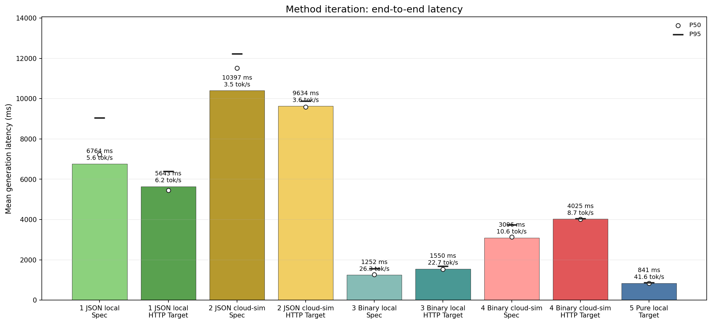
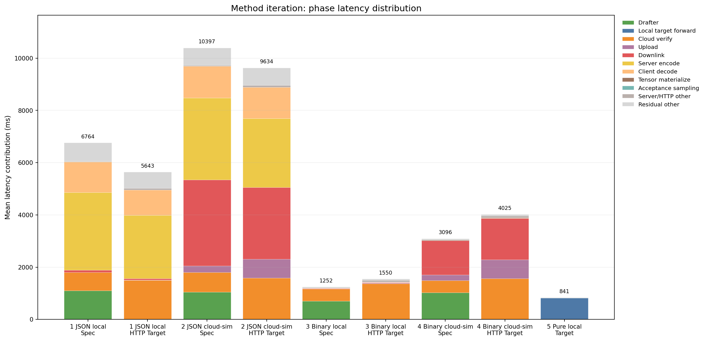
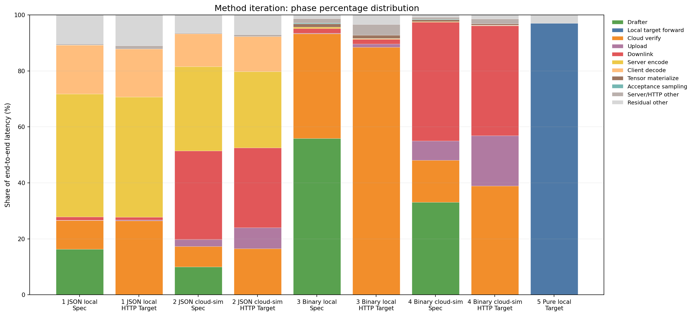
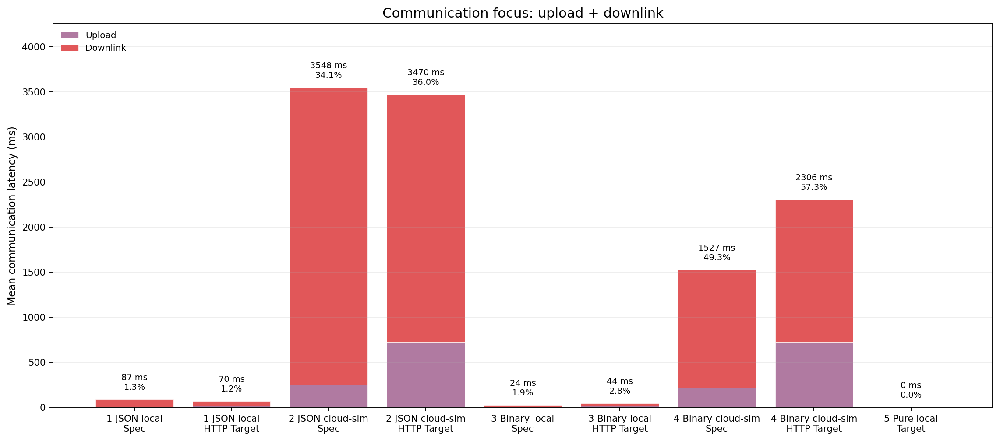
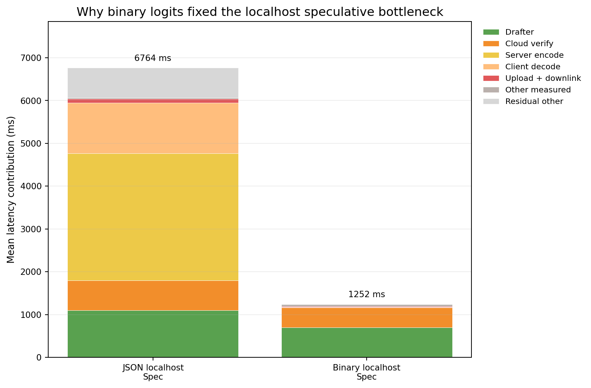

# Speculative Decoding 推理阶段耗时与占比组会汇报

## 1. 汇报目标

本次汇报的核心问题是：**speculative decoding 在端云推理过程中，每个阶段分别耗时多少、占比多少，端云通信 upload/downlink 到底占多大比例。**

为了讲清楚这个问题，实验不是一次完成的，而是按方法逐步迭代：

1. 先实现 target HTTP 服务，把 target model 放到“云端服务”中，客户端通过 HTTP 调用。
2. 初版使用 JSON logits，测出完整阶段耗时。
3. 加入远端网络模拟，拆分 upload、cloud verify、downlink。
4. 发现 JSON 序列化严重拖慢 speculative，于是改成 binary logits。
5. 在 binary logits 下重新跑 localhost 和模拟远端。
6. 最后补一个纯本地 `local_target_ar`，用于确认真正无网络的 target-only 基线。

需要先明确一个口径：报告中的 HTTP `target_ar` 是“通过 target 服务推理”的 target-only baseline，所以它有 upload/downlink；真正没有网络传输的是 `local_target_ar`。

## 2. 图表总览

### 2.1 方法迭代总耗时

从总耗时看，方法迭代带来的变化非常明显：

| 阶段 | 模式 | 平均总耗时 ms | 吞吐 tok/s | 结论 |
|---|---|---:|---:|---|
| JSON localhost | `speculative` | 6763.84 | 5.60 | JSON 协议开销过大，speculative 反而慢。 |
| JSON localhost | HTTP `target_ar` | 5642.71 | 6.24 | target-only 也被 JSON encode/decode 拖慢。 |
| JSON cloud-sim | `speculative` | 10397.21 | 3.47 | 通信和 JSON 序列化共同成为瓶颈。 |
| JSON cloud-sim | HTTP `target_ar` | 9634.37 | 3.63 | 仍然受 JSON 和网络共同影响。 |
| Binary localhost | `speculative` | 1252.06 | 26.34 | binary 修复协议瓶颈后，speculative 快于 HTTP target-only。 |
| Binary localhost | HTTP `target_ar` | 1550.38 | 22.69 | HTTP target-only 比纯本地慢。 |
| Binary cloud-sim | `speculative` | 3095.50 | 10.59 | 远端模拟下 speculative 仍快于 HTTP target-only。 |
| Binary cloud-sim | HTTP `target_ar` | 4024.85 | 8.70 | 网络通信成为主要开销。 |
| Pure local | `local_target_ar` | 840.87 | 41.64 | 真正无网络 target-only，最快。 |

### 2.2 阶段耗时堆叠

这张图是本报告最重要的图：它展示了每种方法下端到端耗时如何由 drafter、cloud verify、server encode、client decode、upload、downlink 等阶段组成。

核心观察：

1. JSON 阶段的大块黄色和橙色分别是 `target_server_encode` 与 `target_response_decode`，说明协议序列化是主要瓶颈。
2. binary logits 后，server encode 和 client decode 几乎消失，总耗时大幅下降。
3. 模拟远端后，红色 downlink 和紫色 upload 明显变大，通信成为主要瓶颈。
4. 纯本地 target-only 只有 local target forward，没有 HTTP 和网络传输。

### 2.3 阶段占比

占比图比绝对耗时更能说明瓶颈迁移：

- JSON localhost：主要瓶颈是序列化/解析。
- JSON cloud-sim：通信和序列化同时占大头。
- Binary localhost：主要瓶颈变为 drafter 和 target verify。
- Binary cloud-sim：通信占比上升到约一半。
- Pure local：几乎全部是 target forward。

### 2.4 端云通信专图

通信只统计 `target_upload + target_downlink`：

| 场景 | `speculative` 通信耗时 | `speculative` 通信占比 | HTTP `target_ar` 通信耗时 | HTTP `target_ar` 通信占比 |
|---|---:|---:|---:|---:|
| JSON localhost | 86.83 ms | 1.28% | 70.08 ms | 1.24% |
| JSON cloud-sim | 3547.69 ms | 34.12% | 3470.15 ms | 36.02% |
| Binary localhost | 23.82 ms | 1.90% | 43.73 ms | 2.82% |
| Binary cloud-sim | 1526.61 ms | 49.32% | 2306.39 ms | 57.30% |
| Pure local | 0.00 ms | 0.00% | - | - |

可以看到，localhost 的通信不是瓶颈；模拟远端后，通信占比接近或超过一半。

### 2.5 JSON 到 Binary 的关键修复

JSON localhost speculative 平均 `6763.84 ms`，binary localhost speculative 平均 `1252.06 ms`。主要改善来自：

| 阶段 | JSON localhost speculative | Binary localhost speculative |
|---|---:|---:|
| `target_server_encode` | 2970.89 ms | 5.82 ms |
| `target_response_decode` | 1182.28 ms | 0.27 ms |
| `generation_total` | 6763.84 ms | 1252.06 ms |

这说明初版 speculative 不如 target-only，并不是 speculative decoding 算法本身一定慢，而是完整 vocab logits 用 JSON 传输时，序列化和解析成本过高。

## 3. 方法实现

### 3.1 系统结构

| 文件 | 作用 |
|---|---|
| `serve_target.py` | target 模型服务端，提供 `/health`、`/metadata`、`/forward`。 |
| `remote_target.py` | 客户端 HTTP wrapper，负责 request encode、upload、response wait、downlink、decode、tensor materialize。 |
| `sampling/speculative_decoding.py` | speculative decoding 主循环，记录 drafter、target verify、acceptance sampling。 |
| `sampling/base_decoding.py` | autoregressive baseline，支持 HTTP target 和纯本地 target。 |
| `benchmark.py` | 非交互式 benchmark 入口，生成 JSONL、CSV 和 PNG 图。 |
| `profiling.py` | 统一记录事件，生成 run summary 和 aggregate summary。 |

### 3.2 推理流程

### 3.3 时间拆分口径

本报告使用非重叠阶段统计端到端耗时：

| 阶段 | 含义 |
|---|---|
| `drafter_generate` | 客户端小模型生成 draft tokens。 |
| `target_request_encode` | 客户端构造 HTTP 请求体。 |
| `target_upload` | 请求上传；远端模拟时包含半 RTT 和上行带宽延迟。 |
| `target_cloud_verify` | 服务端 target forward、logits 截取、CPU 转移。 |
| `target_server_encode` | 服务端将 logits 编码为 JSON 或 binary body。 |
| `server_other_wait` | `target_response_wait - target_cloud_verify - target_server_encode`。 |
| `target_downlink` | 客户端读取 response body；远端模拟时包含半 RTT 和下行带宽延迟。 |
| `target_response_decode` | 客户端解析 response。 |
| `target_tensor_materialize` | binary logits 恢复成 tensor。 |
| `acceptance_sampling` | speculative 接受/拒绝采样。 |
| `residual_other` | 总耗时扣除可观测阶段后的剩余开销。 |

`target_model_forward` 是 `target_cloud_verify` 的内部子项，不再单独加到总占比里，避免重复计算。

## 4. 实验设计

| 项目 | 设置 |
|---|---|
| Target model | `/home/chajiahao/data/hf_models/Qwen2.5-1.5B` |
| Drafter model | `/home/chajiahao/data/hf_models/Qwen2.5-0.5B` |
| 运行环境 | Conda `specd` |
| 设备 | CUDA GPU server |
| 解码策略 | Greedy |
| `gamma` | 4 |
| `max_tokens` | 35 |
| prompts | 默认 3 条 prompt |
| warmup | 每个 prompt/mode 1 次 |
| measured runs | 每个 prompt/mode 3 次，共 9 个样本 |
| binary response | `response_format=binary`, `response_dtype=float32` |
| 远端模拟 | RTT 40 ms，上行 100 Mbps，下行 200 Mbps |

实验输出：

| 文件 | 内容 |
|---|---|
| `raw_events.jsonl` | 每个阶段的原始事件。 |
| `run_summary.csv` | 每次 run 的阶段汇总。 |
| `aggregate_summary.csv` | mean、p50、p95、std 汇总。 |
| `phase_stacked.png` | 单实验目录内的阶段堆叠图。 |
| `phase_boxplot.png` | 单实验目录内的阶段 boxplot。 |

## 5. 方法迭代与结果分析

### 5.1 迭代 1：JSON logits + localhost

目标：先实现 target 服务化和阶段计时，客户端和服务端都在同一台服务器，通过 localhost HTTP 调用。

结果：

| 模式 | 平均总耗时 ms | P50 ms | P95 ms | 吞吐 tok/s |
|---|---:|---:|---:|---:|
| `speculative` | 6763.84 | 7224.99 | 9050.89 | 5.60 |
| HTTP `target_ar` | 5642.71 | 5453.36 | 6389.75 | 6.24 |

关键时间分布：

| 模式 | drafter | cloud verify | server encode | client decode | upload+downlink |
|---|---:|---:|---:|---:|---:|
| `speculative` | 1102.09 ms | 695.52 ms | 2970.89 ms | 1182.28 ms | 86.83 ms |
| HTTP `target_ar` | 0.00 ms | 1495.02 ms | 2424.35 ms | 969.50 ms | 70.08 ms |

结论：localhost 下网络本身很小，speculative 慢的核心原因是 JSON logits 序列化和解析。完整 vocab logits 通过 JSON 传输时，服务端 encode 和客户端 decode 占比过高。

### 5.2 迭代 2：JSON logits + 模拟远端

目标：在 JSON 协议不变的情况下，加入 40 ms RTT、100 Mbps 上行、200 Mbps 下行，观察端云通信占比。

结果：

| 模式 | 平均总耗时 ms | P50 ms | P95 ms | 通信耗时 ms | 通信占比 |
|---|---:|---:|---:|---:|---:|
| `speculative` | 10397.21 | 11511.38 | 12226.62 | 3547.69 | 34.12% |
| HTTP `target_ar` | 9634.37 | 9580.61 | 9877.21 | 3470.15 | 36.02% |

关键时间分布：

| 模式 | drafter | cloud verify | server encode | client decode | upload | downlink |
|---|---:|---:|---:|---:|---:|---:|
| `speculative` | 1043.22 ms | 755.80 ms | 3134.75 ms | 1215.96 ms | 252.31 ms | 3295.39 ms |
| HTTP `target_ar` | 0.00 ms | 1586.56 ms | 2633.00 ms | 1203.55 ms | 722.58 ms | 2747.57 ms |

结论：模拟远端后，通信已经占三分之一以上，但 JSON encode/decode 仍然非常大。因此第二步告诉我们：只模拟网络还不够，必须先修协议层。

### 5.3 迭代 3：Binary logits + localhost

目标：把 response 从 JSON logits 改成 binary logits，降低序列化和解析开销。

结果：

| 模式 | 平均总耗时 ms | P50 ms | P95 ms | 吞吐 tok/s | target 调用次数/run |
|---|---:|---:|---:|---:|---:|
| `speculative` | 1252.06 | 1274.17 | 1556.77 | 26.34 | 10.33 |
| HTTP `target_ar` | 1550.38 | 1531.48 | 1681.73 | 22.69 | 35.00 |

关键时间分布：

| 阶段 | `speculative` ms | `speculative` 占比 | HTTP `target_ar` ms | HTTP `target_ar` 占比 |
|---|---:|---:|---:|---:|
| `drafter_generate` | 699.99 | 55.91% | 0.00 | 0.00% |
| `target_cloud_verify` | 467.79 | 37.36% | 1371.68 | 88.47% |
| `target_upload` | 2.53 | 0.20% | 17.60 | 1.13% |
| `target_downlink` | 21.29 | 1.70% | 26.13 | 1.69% |
| `target_server_encode` | 5.82 | 0.46% | 3.54 | 0.23% |
| `target_response_decode` | 0.27 | 0.02% | 1.18 | 0.08% |

结论：binary logits 后，协议层瓶颈基本消失。localhost 下 speculative 比 HTTP target-only 快 `1550.38 / 1252.06 = 1.24x`，主要原因是 target HTTP 调用从 35 次降到平均 10.33 次。

### 5.4 迭代 4：Binary logits + 模拟远端

目标：在修复协议瓶颈后，再模拟远端网络，看端云通信如何影响 speculative。

结果：

| 模式 | 平均总耗时 ms | P50 ms | P95 ms | 吞吐 tok/s | target 调用次数/run |
|---|---:|---:|---:|---:|---:|
| `speculative` | 3095.50 | 3132.09 | 3742.04 | 10.59 | 10.33 |
| HTTP `target_ar` | 4024.85 | 4023.74 | 4053.23 | 8.70 | 35.00 |

关键时间分布：

| 阶段 | `speculative` ms | `speculative` 占比 | HTTP `target_ar` ms | HTTP `target_ar` 占比 |
|---|---:|---:|---:|---:|
| `drafter_generate` | 1025.43 | 33.13% | 0.00 | 0.00% |
| `target_cloud_verify` | 464.03 | 14.99% | 1564.90 | 38.88% |
| `target_upload` | 213.03 | 6.88% | 725.46 | 18.02% |
| `target_downlink` | 1313.58 | 42.43% | 1580.93 | 39.28% |
| `target_server_encode` | 6.36 | 0.21% | 4.58 | 0.11% |
| `target_response_decode` | 0.52 | 0.02% | 1.58 | 0.04% |

结论：binary 远端模拟下，通信成为核心瓶颈。speculative 的 upload+downlink 为 `1526.61 ms`，占 `49.32%`；HTTP target-only 为 `2306.39 ms`，占 `57.30%`。speculative 仍然更快，原因是它显著减少了 HTTP 往返次数。

### 5.5 迭代 5：补充纯本地 target-only

目标：回答“为什么 target-only 会有网络传输”。为此新增 `local_target_ar`，target 模型直接在 benchmark 进程中运行，不经过 HTTP。

结果：

| 模式 | 平均总耗时 ms | P50 ms | P95 ms | 吞吐 tok/s |
|---|---:|---:|---:|---:|
| `local_target_ar` | 840.87 | 836.82 | 866.75 | 41.64 |

时间分布：

| 阶段 | 平均耗时 ms | 占比 |
|---|---:|---:|
| `target_forward` | 816.15 | 97.06% |
| `residual_other` | 24.72 | 2.94% |
| upload/downlink | 0.00 | 0.00% |

结论：纯本地 target-only 是最快的，因为没有 HTTP、没有 logits 传输、没有 drafter。它是单机理想基线；HTTP `target_ar` 是端云架构 baseline，两者不能混为一谈。

## 6. 综合结论

1. **最初 speculative 不如 target-only，主要是 JSON logits 协议问题。** JSON localhost speculative 中，server encode `2970.89 ms`、client decode `1182.28 ms`，合计超过 4 秒。
2. **binary logits 修复了协议瓶颈。** Binary localhost speculative 总耗时降到 `1252.06 ms`，比 HTTP target-only 的 `1550.38 ms` 更快。
3. **端云通信在远端场景下是核心瓶颈。** Binary cloud-sim speculative 中 upload+downlink 占 `49.32%`，HTTP target-only 中占 `57.30%`。
4. **speculative 在端云架构下的收益来自减少 target 往返次数。** Binary 实验中 speculative 平均 `10.33` 次 target HTTP 调用，HTTP target-only 固定 `35` 次。
5. **纯本地 target-only 是无网络上限基线。** `local_target_ar` 平均 `840.87 ms`，说明如果 target model 本身已经很小、并且本地 GPU 可直接运行，端云 speculative 不一定比纯本地 target-only 快。

## 7. 局限性

1. 网络模拟是代码级 sleep，不是真实公网链路，不能覆盖 TCP 拥塞、丢包、无线抖动等现象。
2. 客户端和服务端仍在同一台服务器，CPU/GPU 调度可能影响绝对值。
3. 样本量为 3 个 prompt、9 个 measured runs，适合观察趋势和阶段占比，但还不足以做严格统计检验。
4. 当前远程 target 服务默认不维护跨请求 KV-cache，会重复计算部分上下文。
5. 当前 binary 协议仍返回完整 vocab logits，便于保持算法语义和精确 profiling，但不是最省带宽的生产协议。

## 8. 后续优化方向

1. **降低 downlink 体积**：尝试 `response_dtype=float16`，理论上 logits body 减半。
2. **服务端完成更多 verify/acceptance**：云端只返回 accepted tokens 和必要统计，避免完整 logits 下行。
3. **加入 target KV-cache**：服务端维护 session cache，减少重复 forward。
4. **扫描 gamma**：测试 gamma=2/4/6/8，找到减少 RTT 次数和增大单次 logits block 的平衡点。
5. **真实双机或 `tc/netem` 实验**：验证代码级远端模拟结论是否能迁移到真实网络。

