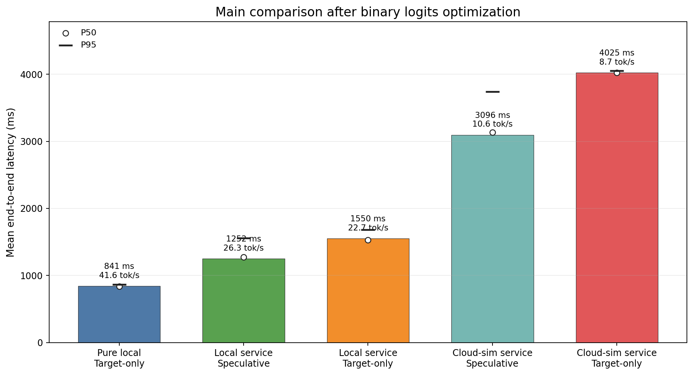
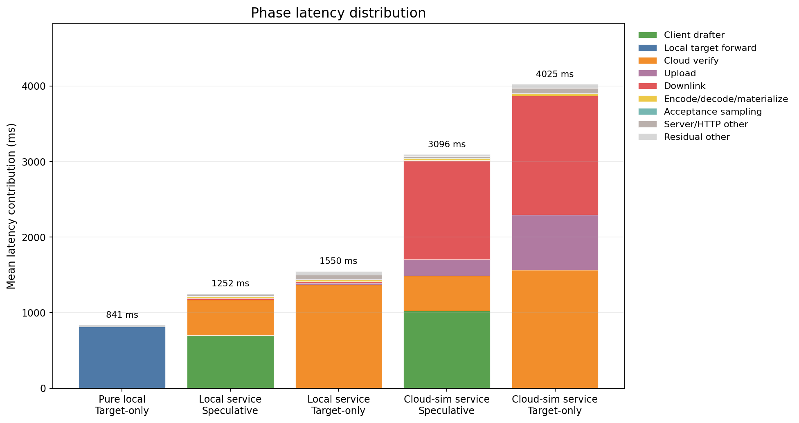
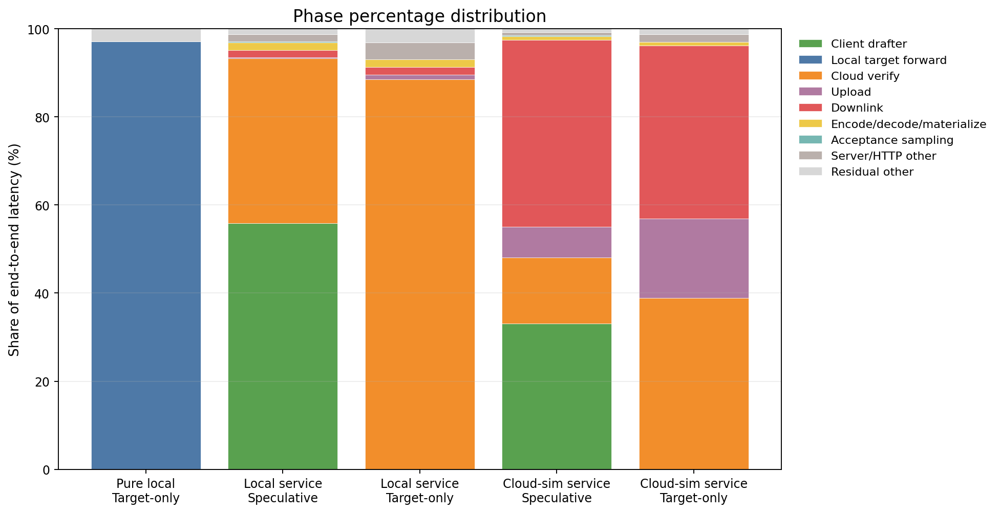
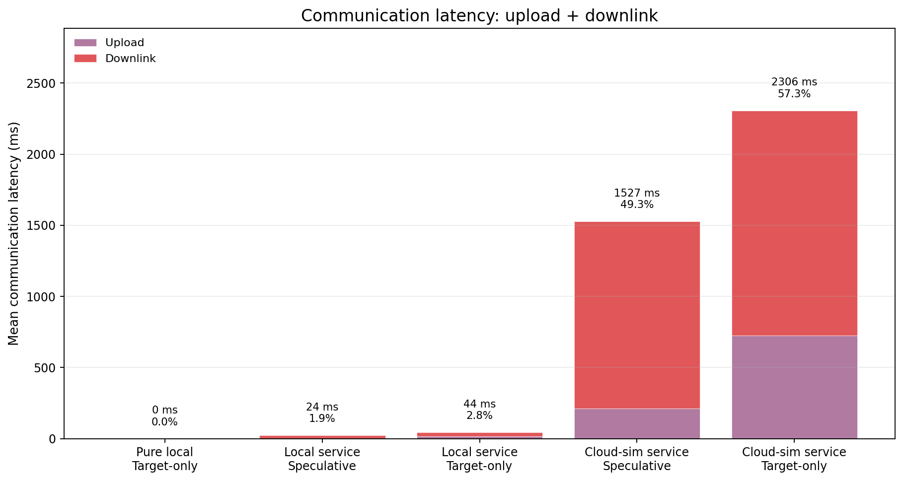

# Speculative Decoding 端云推理时间分布组会汇报

## 1. 本次汇报要回答什么

本次实验关注的不是单纯“谁更快”，而是要把 speculative decoding 推理过程拆开，看每一段分别花了多少时间：

- 客户端 drafter 小模型生成 draft tokens 花多久。
- 客户端上传请求到 target 服务花多久。
- 服务端 target 模型验证 draft tokens 花多久。
- 服务端把 logits 返回给客户端花多久。
- 客户端下行接收、解析、恢复 tensor 花多久。
- acceptance sampling 花多久。

最终目的是回答：**端云协同推理里，通信时间 upload/downlink 到底占多少，speculative decoding 能不能通过减少 target 调用次数抵消通信开销。**

## 2. 先解释实验里的几个方法

下面这几个名字是报告和图里的核心口径，先讲清楚，否则后面的图会不好读。

### 2.1 Pure local Target-only 是什么

`Pure local Target-only` 对应代码里的 `local_target_ar`。

它的含义是：

- target 模型直接在 benchmark 进程里运行。
- 不启动 `serve_target.py`。
- 不经过 HTTP。
- 没有 upload/downlink。
- 每生成一个 token，直接在本地调用 target model forward。

这个模式是**无网络、无服务化开销的理想本地基线**。它回答的问题是：如果 target 模型就在本机 GPU 上，单纯 autoregressive 推理最快能到什么水平。

### 2.2 Target HTTP 是什么

`Target HTTP` 指的是把 target 模型从 benchmark 主进程里拆出来，单独启动成一个 HTTP 服务。

服务端命令类似：

```bash
python serve_target.py \
  --model /home/chajiahao/data/hf_models/Qwen2.5-1.5B \
  --device cuda \
  --local-files-only
```

服务端只加载一次 target 模型，然后提供接口：

| 接口 | 作用 |
|---|---|
| `/health` | 检查服务是否启动。 |
| `/metadata` | 返回模型、设备、dtype 等信息。 |
| `/forward` | 接收 `input_ids`，执行 target forward，返回 logits。 |

一次 `/forward` 的流程是：

1. 客户端把 `input_ids`、`logits_start`、`logits_end` 等信息编码成请求。
2. 请求通过 HTTP 发给 target 服务，这段记为 `target_upload`。
3. 服务端把 `input_ids` 转成 CUDA tensor。
4. 服务端执行 target model forward。
5. 服务端截取本轮需要的 logits。
6. 服务端把 logits 编码成 response body。
7. 客户端读取 response body，这段记为 `target_downlink`。
8. 客户端解析 response，并把 binary logits 恢复成 tensor。

为什么要做 Target HTTP？

- 它模拟“target 大模型在云端服务，客户端只负责调度和小模型 drafter”的端云架构。
- 它让我们能把 RTT 拆成 upload、cloud verify、downlink。
- 它也能比较 speculative decoding 和 target-only 在“同样服务化 target”的情况下谁更快。

所以要注意：**HTTP Target-only 不是纯本地 target-only。** 它虽然不用 drafter，但仍然通过 HTTP 调用 target 服务，因此一定会有 upload/downlink。

### 2.3 Local service Target-only 是什么

图里的 `Local service Target-only` 对应代码里的 HTTP `target_ar`，但服务端和客户端都在同一台服务器。

它的含义是：

- target 模型在 `serve_target.py` 里。
- benchmark 进程通过 `http://127.0.0.1:8000/forward` 调用 target。
- 不使用 drafter。
- 每生成一个 token 调一次 target HTTP 服务。

这个模式回答的问题是：**如果 target 被服务化，但不使用 speculative decoding，HTTP target-only 的时间分布是什么。**

### 2.4 Local service Speculative 是什么

图里的 `Local service Speculative` 是本地服务化版本的 speculative decoding。

它的含义是：

- drafter 小模型在客户端 benchmark 进程里。
- target 大模型在 `serve_target.py` HTTP 服务里。
- 客户端先用 drafter 一次生成多个 draft tokens。
- 再把 draft tokens 发给 target 服务验证。
- target 一次 forward 可以验证多个 draft tokens。
- 客户端根据 target logits 做 acceptance sampling。

这个模式的优势来源是：**减少 target HTTP 调用次数**。本次 binary 实验里，speculative 平均每个 measured run 约 `10.33` 次 target HTTP 调用，而 HTTP target-only 固定 `35` 次。

### 2.5 Cloud-sim service 是什么

`Cloud-sim service` 仍然是在同一台服务器上跑 client 和 target service，但在客户端代码里主动加入网络延迟，用来近似“服务端在远端云上”的情况。

本次模拟参数：

| 参数 | 数值 |
|---|---:|
| RTT | 40 ms |
| 上行带宽 | 100 Mbps |
| 下行带宽 | 200 Mbps |

模拟公式：

```text
target_upload   = RTT / 2 + request_bytes / uplink_bandwidth
target_downlink = RTT / 2 + response_bytes / downlink_bandwidth
```

因此：

- `Local service` 表示 localhost 服务化，没有额外模拟网络。
- `Cloud-sim service` 表示同样的服务化架构，但额外模拟远端 RTT 和带宽。

它不是公网实测，但能帮助我们观察：当 target 真在远端时，upload/downlink 会如何改变时间占比。

### 2.6 JSON 到 Binary 是什么

一开始 `/forward` 返回 JSON 格式 logits。由于 vocab 很大，完整 logits 转成 JSON list 后非常慢，服务端 encode 和客户端 decode 都成了大瓶颈。

后来改成 binary logits：

- 服务端把 logits 转成连续 tensor bytes。
- response body 直接返回二进制。
- shape 和 dtype 放在 HTTP header。
- 客户端用 `torch.frombuffer` 恢复 tensor。

这个改动只是协议优化，不改变 speculative decoding 算法。后面的主结果都以 binary logits 为准；JSON 结果只作为“为什么要做 binary 优化”的背景简单说明。

## 3. 图中的方法名对照

| 图中名字 | 代码 mode | 是否 HTTP | 是否 drafter | 是否模拟远端网络 | 含义 |
|---|---|---|---|---|---|
| Pure local Target-only | `local_target_ar` | 否 | 否 | 否 | target 直接本地推理，无网络基线。 |
| Local service Speculative | `speculative` | 是 | 是 | 否 | localhost target 服务 + speculative decoding。 |
| Local service Target-only | `target_ar` | 是 | 否 | 否 | localhost target 服务 + autoregressive target-only。 |
| Cloud-sim service Speculative | `speculative` | 是 | 是 | 是 | target 服务 + speculative + 远端网络模拟。 |
| Cloud-sim service Target-only | `target_ar` | 是 | 否 | 是 | target 服务 + target-only + 远端网络模拟。 |

## 4. 代码流程

### 4.1 服务化 target 流程


### 4.2 Speculative decoding 流程


### 4.3 Target-only HTTP 流程


Target-only HTTP 每生成一个 token 都要请求一次 target 服务，因此 RTT 次数多。Speculative 每次让 drafter 先猜多个 token，再让 target 一次验证多个 token，因此 target HTTP 调用次数更少。

## 5. 时间拆分口径

| 阶段 | 含义 |
|---|---|
| `drafter_generate` | 客户端小模型生成 draft tokens。 |
| `target_request_encode` | 客户端构造 HTTP 请求。 |
| `target_upload` | 请求上传；cloud-sim 中包含半 RTT 和上行带宽延迟。 |
| `target_cloud_verify` | 服务端 target forward、logits 截取、CPU 转移。 |
| `target_server_encode` | 服务端把 logits 编码成 response body。 |
| `server_other_wait` | HTTP 服务框架、等待和其它服务端开销。 |
| `target_downlink` | 客户端读取 response body；cloud-sim 中包含半 RTT 和下行带宽延迟。 |
| `target_response_decode` | 客户端解析响应 header 或元数据。 |
| `target_tensor_materialize` | 客户端把 binary logits 恢复成 tensor。 |
| `acceptance_sampling` | speculative decoding 接受/拒绝采样。 |
| `residual_other` | 端到端总时间扣除已观测阶段后的剩余开销。 |

`target_model_forward` 是 `target_cloud_verify` 的内部子项，不再单独加到总占比，避免重复计算。

## 6. 实验参数

### 6.1 推理任务

本实验的推理任务是**短文本自回归生成**：给定一条用户 prompt，让模型继续生成回答。实验不评估回答质量、准确率或任务分数，只测生成过程中的端到端延迟和各阶段时间分布。

默认使用 3 条 prompt：

| prompt id | prompt 内容 | 任务类型 |
|---:|---|---|
| 0 | `Explain speculative decoding in two concise paragraphs.` | 概念解释 |
| 1 | `Write a short Python function that computes Fibonacci numbers.` | 代码生成 |
| 2 | `Summarize why latency profiling matters for distributed inference.` | 技术总结 |

每条 prompt 最多生成 `35` 个 token。由于启用了 tokenizer 的 chat template，实际送入模型的是用户消息格式化后的 chat prompt，而不是裸字符串直接拼接。

### 6.2 模型和解码设置

| 项目 | 设置 |
|---|---|
| Target model | `/home/chajiahao/data/hf_models/Qwen2.5-1.5B` |
| Drafter model | `/home/chajiahao/data/hf_models/Qwen2.5-0.5B` |
| 设备 | CUDA GPU server |
| 解码策略 | Greedy，使用 `GreedyProcessor` |
| `gamma` | 4 |
| `max_tokens` | 35 |
| `use_cache` | `False`，远程 target 服务不维护跨请求 KV-cache |
| seed | 42 起始，并按 prompt/run 递增设置 |
| chat template | 启用，`--chat-template=True` |
| 输出文本保存 | 默认不保存，除非显式加 `--save-text` |

### 6.3 实验环境和统计口径

| 项目 | 设置 |
|---|---|
| 运行环境 | Conda `specd` |
| prompts | 默认 3 条 prompt |
| warmup | 每个 prompt/mode 1 次 |
| measured runs | 每个 prompt/mode 3 次，共 9 个样本 |
| response format | binary logits, float32 |
| cloud-sim network | RTT 40 ms, uplink 100 Mbps, downlink 200 Mbps |

统计口径：

- 图表和表格使用 measured runs，不包含 warmup。
- `generation_total` 是每次生成的端到端耗时。
- `throughput_tokens_s = generated_tokens / generation_total_seconds`。
- `acceptance_rate` 只对 speculative 模式有意义。
- 本实验重点是 latency profiling，不对不同输出文本做人工评分或语义质量比较。

## 7. 主实验结果

### 7.1 端到端总耗时



| 方法 | 平均总耗时 ms | P50 ms | P95 ms | 吞吐 tok/s |
|---|---:|---:|---:|---:|
| Pure local Target-only | 840.87 | 836.82 | 866.75 | 41.64 |
| Local service Speculative | 1252.06 | 1274.17 | 1556.77 | 26.34 |
| Local service Target-only | 1550.38 | 1531.48 | 1681.73 | 22.69 |
| Cloud-sim service Speculative | 3095.50 | 3132.09 | 3742.04 | 10.59 |
| Cloud-sim service Target-only | 4024.85 | 4023.74 | 4053.23 | 8.70 |

结论：

- 纯本地 target-only 最快，因为没有 HTTP 和网络。
- 在同样使用 target HTTP 服务时，speculative 比 target-only 快。
- cloud-sim 下两者都变慢，但 speculative 仍然更快。

### 7.2 阶段耗时分布



这张图展示了每种方法的绝对耗时组成。重点看三件事：

1. Pure local Target-only 几乎全是 `Local target forward`。
2. Local service Speculative 的主要开销是 `Client drafter` 和 `Cloud verify`。
3. Cloud-sim service 中红色 `Downlink` 和紫色 `Upload` 明显变大，通信变成主导因素。

### 7.3 阶段占比分布



| 方法 | 主要瓶颈 |
|---|---|
| Pure local Target-only | target forward，占 97.06%。 |
| Local service Speculative | drafter 55.91%，cloud verify 37.36%。 |
| Local service Target-only | cloud verify 88.47%。 |
| Cloud-sim service Speculative | downlink 42.43%，drafter 33.13%，cloud verify 14.99%。 |
| Cloud-sim service Target-only | downlink 39.28%，cloud verify 38.88%，upload 18.02%。 |

### 7.4 通信耗时



| 方法 | upload ms | downlink ms | upload+downlink ms | 通信占比 |
|---|---:|---:|---:|---:|
| Pure local Target-only | 0.00 | 0.00 | 0.00 | 0.00% |
| Local service Speculative | 2.53 | 21.29 | 23.82 | 1.90% |
| Local service Target-only | 17.60 | 26.13 | 43.73 | 2.82% |
| Cloud-sim service Speculative | 213.03 | 1313.58 | 1526.61 | 49.32% |
| Cloud-sim service Target-only | 725.46 | 1580.93 | 2306.39 | 57.30% |

结论：

- localhost 下通信不是瓶颈。
- cloud-sim 下通信接近或超过总时间一半。
- Speculative 在 cloud-sim 下通信占比更低，主要因为 target HTTP 调用次数少。

## 8. 为什么 speculative 在服务化 target 下更快

本次 binary 实验中：

| 方法 | 平均 target 调用次数/run | 平均总耗时 ms |
|---|---:|---:|
| Local service Speculative | 10.33 | 1252.06 |
| Local service Target-only | 35.00 | 1550.38 |
| Cloud-sim service Speculative | 10.33 | 3095.50 |
| Cloud-sim service Target-only | 35.00 | 4024.85 |

Target-only HTTP 每生成一个 token 都需要一次 HTTP 往返。Speculative 先用本地 drafter 猜多个 token，再让 target 一次验证多个 token，因此减少了 target HTTP 调用次数。

在 localhost 下，减少 target verify 次数已经能带来收益。在 cloud-sim 下，减少 RTT 次数更重要，所以 speculative 相比 HTTP target-only 的优势更明显。

## 9. JSON 到 Binary 的简要说明

早期 JSON logits 结果中，Local service Speculative 平均耗时约 `6763.84 ms`，比 HTTP Target-only 的 `5642.71 ms` 更慢。主要不是 speculative 算法慢，而是完整 vocab logits 用 JSON 传输太重：

| 阶段 | JSON localhost speculative | Binary localhost speculative |
|---|---:|---:|
| `target_server_encode` | 2970.89 ms | 5.82 ms |
| `target_response_decode` | 1182.28 ms | 0.27 ms |
| `generation_total` | 6763.84 ms | 1252.06 ms |

因此后续主实验统一采用 binary logits。JSON 结果只用来说明协议优化的必要性，不作为最终性能结论。

## 10. 结论

1. **Target HTTP 是端云架构模拟的核心。** 它把 target 模型拆成服务端，客户端通过 HTTP 请求 logits，因此可以测 upload、cloud verify、downlink。
2. **HTTP Target-only 有网络传输是正常的。** 它不是纯本地 target-only，而是“通过 target HTTP 服务做 autoregressive 推理”。
3. **真正无网络的 baseline 是 Pure local Target-only。** 它平均 `840.87 ms`，最快。
4. **在服务化 target 架构下，speculative 快于 HTTP target-only。** Local service 下约 `1.24x`，cloud-sim 下约 `1.30x`。
5. **远端模拟下通信是最大瓶颈。** Cloud-sim Speculative 的通信占 `49.32%`，Cloud-sim Target-only 的通信占 `57.30%`。
6. **Speculative 的核心收益来自减少 target HTTP 调用次数。** 本次实验从 target-only 的 35 次/run 降到 speculative 的 10.33 次/run。

## 11. 后续工作

1. 用 `response_dtype=float16` 降低 logits 下行体积。
2. 让服务端完成更多 verify/acceptance，只返回 accepted tokens，减少 downlink。
3. 给 target HTTP 服务加入 KV-cache，减少重复 forward。
4. 扫描 `gamma=2/4/6/8`，寻找通信次数和单次 response 体积的平衡点。
5. 用真实双机或 `tc/netem` 替代代码级 sleep，验证真实网络下的时间分布。
