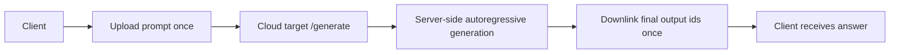
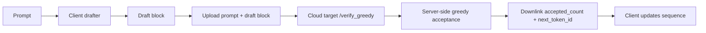
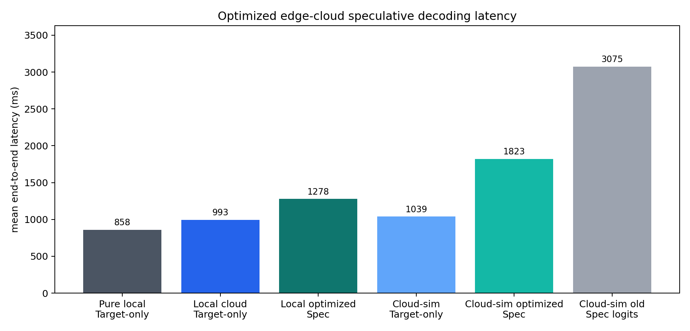
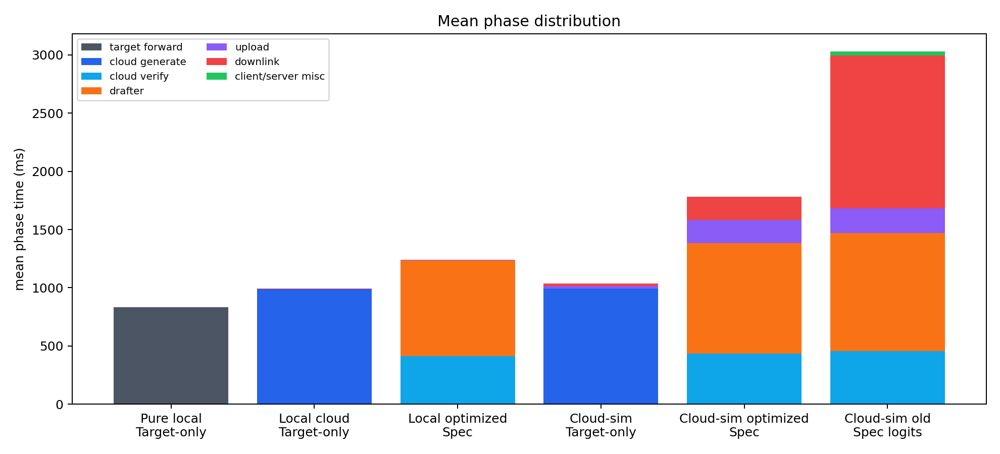
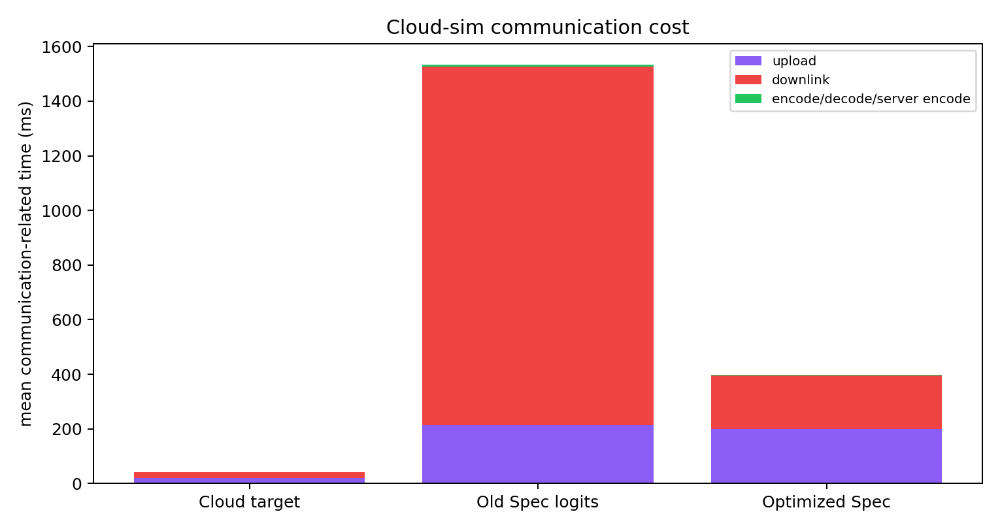
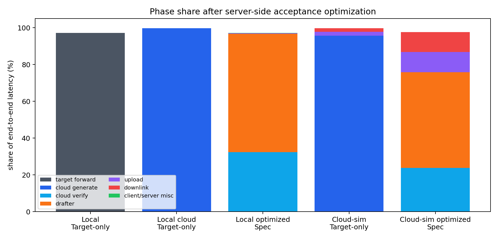
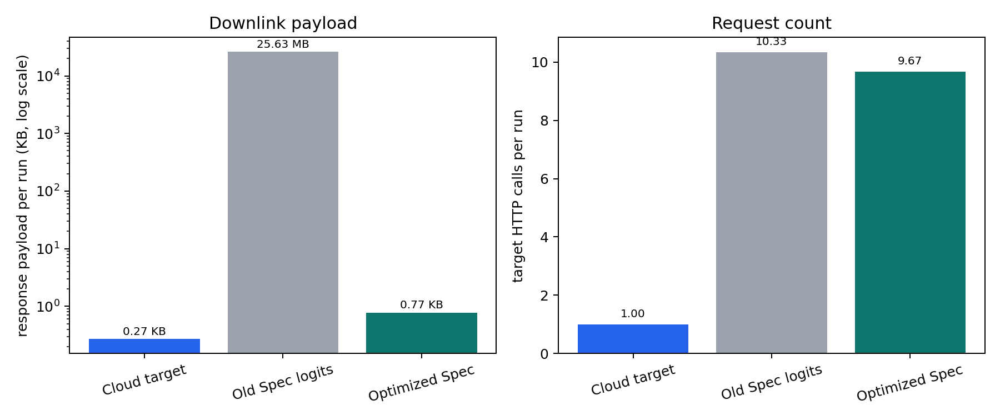

# Edge-cloud Speculative Decoding 优化后时间分布组会汇报

## 1. 汇报目标

本轮实验继续围绕一个核心问题：

> 在端云协同 speculative decoding 推理中，完整推理过程各阶段分别耗时多少，占比多少，通信开销尤其是 upload/downlink 到底是不是瓶颈？

上一轮结果发现，原始 `speculative` 端云实现会把 target 端验证得到的 full-vocabulary logits 下行给端侧。Qwen2.5 的词表约 151936，logits block 体积很大，在模拟远端网络下 downlink 成为最大瓶颈。

本轮做了针对性优化：把 greedy acceptance 放到服务端执行，端侧不再下载 logits，而只下载 compact verification result。

旧实验数据保留在：

- `experiments/edge_cloud`

新一轮优化后实验数据放在：

- `experiments/edge_cloud_optimized`

## 2. 推理任务和实验设置

本实验是短文本自回归生成延迟测试，只测耗时和阶段占比，不评估回答质量。

默认 3 条 prompt：

| prompt id | prompt | 类型 |
|---:|---|---|
| 0 | `Explain speculative decoding in two concise paragraphs.` | 概念解释 |
| 1 | `Write a short Python function that computes Fibonacci numbers.` | 代码生成 |
| 2 | `Summarize why latency profiling matters for distributed inference.` | 技术总结 |

实验参数：

| 项目 | 设置 |
|---|---|
| Target model | `/home/chajiahao/data/hf_models/Qwen2.5-1.5B` |
| Drafter model | `/home/chajiahao/data/hf_models/Qwen2.5-0.5B` |
| 解码策略 | Greedy |
| `max_tokens` | 35 |
| `gamma` | 4 |
| measured samples | 3 prompts × 3 measured runs = 9 |
| warmup | 每个 prompt/mode 1 次 |
| 远端模拟 | RTT 40 ms，上行 100 Mbps，下行 200 Mbps |
| KV-cache | 本轮主实验 `use_cache=False` |

## 3. 方法对比

| 方法 | benchmark mode | 通信模式 | 用途 |
|---|---|---|---|
| Pure local Target-only | `local_target_ar` | 无 HTTP | 本地无网络理想 baseline |
| Cloud Target-only | `cloud_target_generate` | 上传 prompt 一次，云端生成完整答案，下行最终 token ids 一次 | 正常云端推理 baseline |
| Old Speculative logits-downlink | `speculative` | 端侧 drafter 生成 draft block，云端 target 验证，返回 logits block | 上一轮端云 speculative 实现，用来定位 full logits 下行瓶颈 |
| Optimized Speculative server-accept | `speculative_server_accept` | 端侧 drafter 生成 draft block，云端 target 验证 greedy acceptance，只返回 `accepted_count` 和 `next_token_id` | 本轮优化后的端云 speculative |

`target_ar` 仍然只作为 diagnostic mode，不再进入主要对比。原因是它每个 token 一次 HTTP 请求，不符合常规云端 LLM 服务“上传任务一次，云端生成完整答案，再下发答案”的模式。

## 4. 方法实现

### 4.1 Target HTTP 服务

`serve_target.py` 当前有三个主要接口：

| 接口 | 用途 |
|---|---|
| `/generate` | Cloud Target-only。端侧上传 prompt，服务端完成完整 autoregressive generation，只返回最终 output ids。 |
| `/forward` | 旧 speculative logits-downlink。服务端返回 target logits，端侧执行 acceptance sampling。 |
| `/verify_greedy` | 新 optimized speculative。服务端完成 greedy token 比较，只返回 compact acceptance metadata。 |

### 4.2 正常 Cloud Target-only 流程



该 baseline 代表常见云端推理服务：端侧不逐 token 请求云端，而是把生成循环放在云端完成。

### 4.3 旧 Speculative logits-downlink 流程


旧流程的问题是：每轮 verification 都要下行 target logits。对于 Qwen2.5，这会让每次运行平均下行约 25.63 MB。

### 4.4 新 Speculative server-accept 流程



新流程的关键变化：

- target logits 不再下行到端侧。
- 服务端直接比较 target greedy token 和 drafter draft token。
- 返回体从 MB 级 logits 变成 KB 级 JSON。
- 当前实现适用于 greedy decoding。若要保持 probabilistic speculative sampling 的分布一致性，仍需要返回或压缩更多分布信息。

## 5. 总体结果



| 方法 | 平均总耗时 ms | P50 ms | P95 ms | 吞吐 tok/s | 平均生成 tokens |
|---|---:|---:|---:|---:|---:|
| Pure local Target-only | 858.07 | 857.30 | 879.03 | 40.80 | 35.00 |
| Local Cloud Target-only | 993.33 | 964.65 | 1095.66 | 35.38 | 35.00 |
| Local Optimized Speculative | 1277.61 | 1323.79 | 1421.77 | 27.68 | 35.00 |
| Cloud-sim Cloud Target-only | 1038.97 | 995.38 | 1169.39 | 33.85 | 35.00 |
| Cloud-sim Optimized Speculative | 1822.89 | 1979.39 | 2134.78 | 19.87 | 35.00 |
| Cloud-sim Old Speculative logits | 3075.09 | 3145.65 | 3784.40 | 10.69 | 32.78 |

关键结论：

- 优化有效：模拟远端下，speculative 从 `3075.09 ms` 降到 `1822.89 ms`，总耗时下降约 `40.7%`。
- 通信瓶颈显著缓解：旧 speculative 的模拟远端 downlink 为 `1313.21 ms`，优化后为 `196.09 ms`，下降约 `85.1%`。
- 但优化后 speculative 仍慢于正常 Cloud Target-only：模拟远端下 `1822.89 ms` vs `1038.97 ms`，约慢 `1.75x`。
- 本轮优化解决的是 logits 下行体积问题，但还没有解决多轮 RTT 和 drafter 计算开销问题。

## 6. 阶段耗时分布



### 6.1 优化后本地服务场景

| 方法 | 主要阶段 | 解释 |
|---|---|---|
| Local Cloud Target-only | `target_cloud_generate` 990.40 ms | 绝大部分时间在云端 target 完整生成，HTTP 开销几乎可以忽略。 |
| Local Optimized Speculative | drafter 823.60 ms + cloud verify 412.84 ms | 没有真实网络时，主要瓶颈是端侧 drafter 和云端 target verification 的叠加。 |

本地服务场景下，优化后 speculative 总耗时 `1277.61 ms`，相比 Local Cloud Target-only 的 `993.33 ms` 仍慢约 `1.29x`。这说明即使去掉网络瓶颈，当前模型组合和实现下，drafter 的额外计算还没有换来足够 target 串行步骤减少。

### 6.2 模拟远端场景

| 方法 | cloud/server 计算 | drafter | upload | downlink | 总耗时 |
|---|---:|---:|---:|---:|---:|
| Cloud-sim Cloud Target-only | 995.05 ms | 0.00 ms | 20.70 ms | 20.28 ms | 1038.97 ms |
| Cloud-sim Old Speculative logits | 454.29 ms verify | 1015.50 ms | 213.39 ms | 1313.21 ms | 3075.09 ms |
| Cloud-sim Optimized Speculative | 432.82 ms verify | 951.10 ms | 200.04 ms | 196.09 ms | 1822.89 ms |



可以看到：

- Cloud Target-only 只有 1 次请求，因此 40 ms RTT 只出现一次。
- Optimized Speculative 平均约 9.67 次 target HTTP verification，因此即使 response 很小，仍然有约 `9.67 × 40 ms ≈ 387 ms` 的 RTT 下限。
- Old Speculative 除了多次 RTT，还要下载 full logits，因此 downlink 从 `196.09 ms` 膨胀到 `1313.21 ms`。

## 7. 阶段占比



| 方法 | 关键占比 |
|---|---|
| Local Cloud Target-only | cloud generate 约 `99.7%` |
| Local Optimized Speculative | drafter 约 `64.5%`，cloud verify 约 `32.3%`，通信约 `0.4%` |
| Cloud-sim Cloud Target-only | cloud generate 约 `95.8%`，通信约 `4.0%` |
| Cloud-sim Optimized Speculative | drafter 约 `52.2%`，cloud verify 约 `23.7%`，upload 约 `11.0%`，downlink 约 `10.8%` |
| Cloud-sim Old Speculative logits | downlink 约 `42.7%`，drafter 约 `33.0%`，cloud verify 约 `14.8%`，upload 约 `6.9%` |

本轮优化把最大瓶颈从“下行 logits 带宽”转移到了“drafter 计算 + 多轮 RTT + target verification”。

## 8. 通信体积和调用次数



| 方法 | target HTTP calls/run | request/run | response/run |
|---|---:|---:|---:|
| Cloud Target-only | 1.00 | 251.7 B | 276.3 B |
| Old Speculative logits | 10.33 | 3734.6 B | 25.63 MB |
| Optimized Speculative | 9.67 | 2893.7 B | 793.0 B |

优化效果：

- response payload 从 `25.63 MB/run` 降到 `793 B/run`。
- 下行体积约缩小 `3.39 × 10^4` 倍。
- 模拟远端下 downlink 时间从 `1313.21 ms` 降到 `196.09 ms`。

但注意，Optimized Speculative 的 downlink 仍有约 `196 ms`，并不是因为 payload 大，而是因为每次 verification 都包含约 20 ms 的 one-way latency。平均 9.67 次请求带来约 193 ms 的 downlink latency floor。

## 9. 为什么优化后仍不如 Cloud Target-only？

### 9.1 多轮 RTT 仍然存在

Cloud Target-only 是一次请求：

- upload prompt once
- server generate full answer
- downlink final ids once

Optimized Speculative 是多轮 verification：

- 平均 `9.67` 次 target HTTP call/run
- 40 ms RTT 模拟下，仅往返传播延迟就接近 `387 ms`

所以即使每次 response 很小，频繁交互仍然不利于远端云场景。

### 9.2 Drafter 对当前 target 不够“便宜”

模拟远端下：

- Cloud Target-only 的云端完整生成耗时约 `995.05 ms`
- Optimized Speculative 的 drafter 单独耗时约 `951.10 ms`
- 还要额外加上 target verification `432.82 ms`

也就是说，0.5B drafter 的计算开销几乎接近 1.5B target 完整生成的一次总耗时。当前模型规模组合下，drafter 额外成本太高。

### 9.3 当前没有使用 KV-cache

本轮为了简化远端复现，`use_cache=False`。这会导致：

- drafter 每轮重新计算前缀。
- target verification 也重新计算输入 prefix + draft block。
- speculative 本来应该节省的串行 target decode 步骤没有充分转化成实际加速。

### 9.4 Acceptance rate 还可以，但不足以抵消额外开销

Optimized Speculative 的 acceptance rate 平均约 `0.775`，比旧 logits-downlink 的 `0.670` 更高。但是在当前实现中，收益仍被 drafter compute 和多轮 RTT 抵消。

## 10. 当前结论

本轮优化证明了上一轮判断是正确的：

- 旧端云 speculative 的最大通信问题确实是 full logits 下行。
- 将 acceptance 放到服务端后，response payload 从 MB 级降到 KB 级以下。
- 模拟远端下总耗时从 `3075.09 ms` 降到 `1822.89 ms`，有明显改善。

但优化后仍没有超过正常 Cloud Target-only：

- Cloud-sim Cloud Target-only：`1038.97 ms`
- Cloud-sim Optimized Speculative：`1822.89 ms`

因此当前阶段的结论不是“speculative decoding 在端云场景无效”，而是：

> 在当前 Qwen2.5-1.5B / Qwen2.5-0.5B、greedy、gamma=4、无 KV-cache、每轮 HTTP verification 的实现下，server-side acceptance 解决了 logits 下行问题，但 speculative 仍受 drafter 计算和多轮 RTT 限制，尚不能超过一次性云端 target-only 生成。

## 11. 下一步优化方向

优先级建议如下：

1. 做 `gamma` sweep：测试 `gamma=4,8,12,16`。更大的 gamma 可能减少 verification 次数和 RTT，但也可能降低 acceptance rate，需要实验确定最优点。
2. 加 drafter KV-cache：端侧 drafter 不应每轮重算完整前缀。
3. 加 target server-side session cache：服务端维护 `session_id -> KV-cache`，端侧每轮只上传新增 draft tokens，不上传完整 prefix，也不让 target 重算完整 prefix。
4. 对比更大的 target 或更小的 drafter：speculative 的收益依赖 target/drafter 成本比。当前 0.5B drafter 对 1.5B target 不够便宜。
5. 减少交互轮数：可以探索更大 block、多 block pipeline 或 adaptive gamma，让远端场景下 RTT 不再按 verification 次数线性累积。

下一轮最直接的实验是：

```bash
python benchmark.py \
  --target-url http://127.0.0.1:8000 \
  --drafter-model /home/chajiahao/data/hf_models/Qwen2.5-0.5B \
  --tokenizer /home/chajiahao/data/hf_models/Qwen2.5-1.5B \
  --modes cloud_target_generate,speculative_server_accept \
  --local-files-only \
  --target-output-device cuda \
  --response-format binary \
  --response-dtype float32 \
  --device cuda \
  --simulate-network \
  --sim-rtt-ms 40 \
  --sim-uplink-mbps 100 \
  --sim-downlink-mbps 200 \
  --gamma 8 \
  --output-dir experiments/edge_cloud_optimized_gamma/gamma8_cloud_sim
```

建议同时跑 `gamma=4,8,12,16`，再比较总耗时、HTTP calls/run、acceptance rate、drafter time、target verify time 和 upload/downlink 占比。
