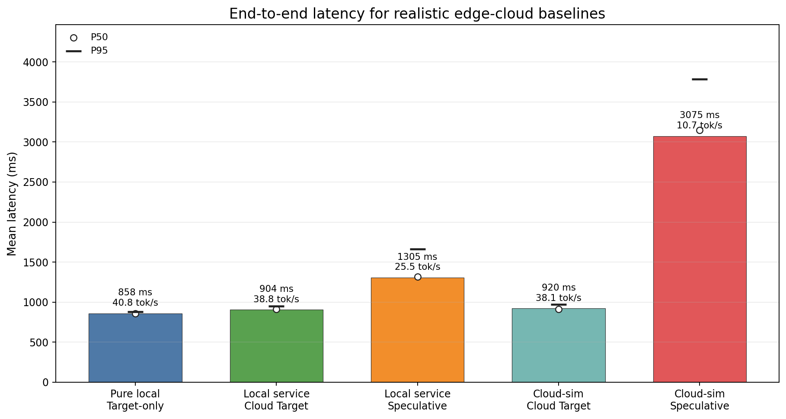
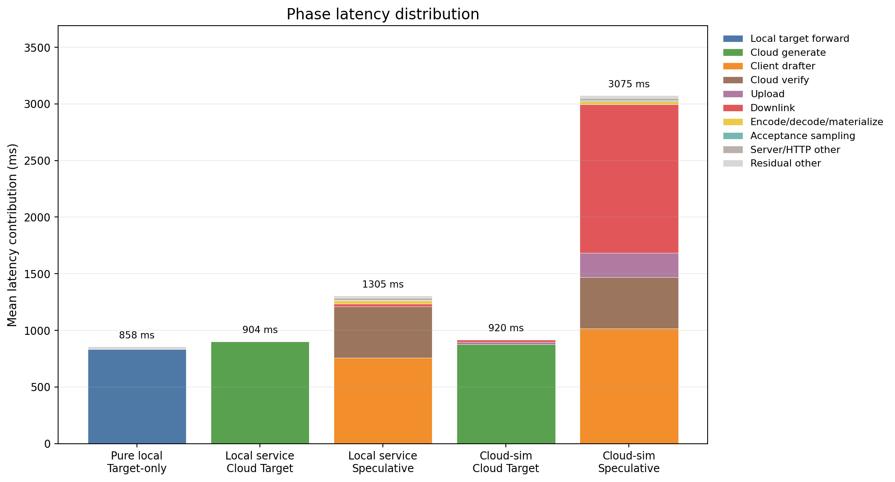
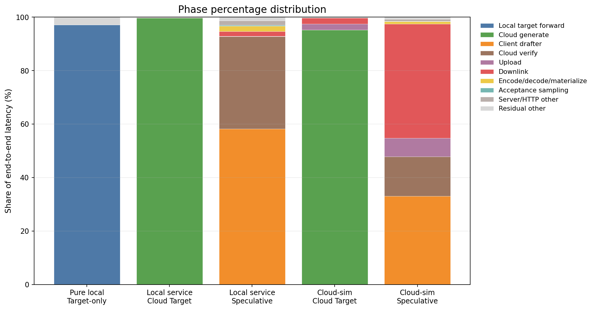
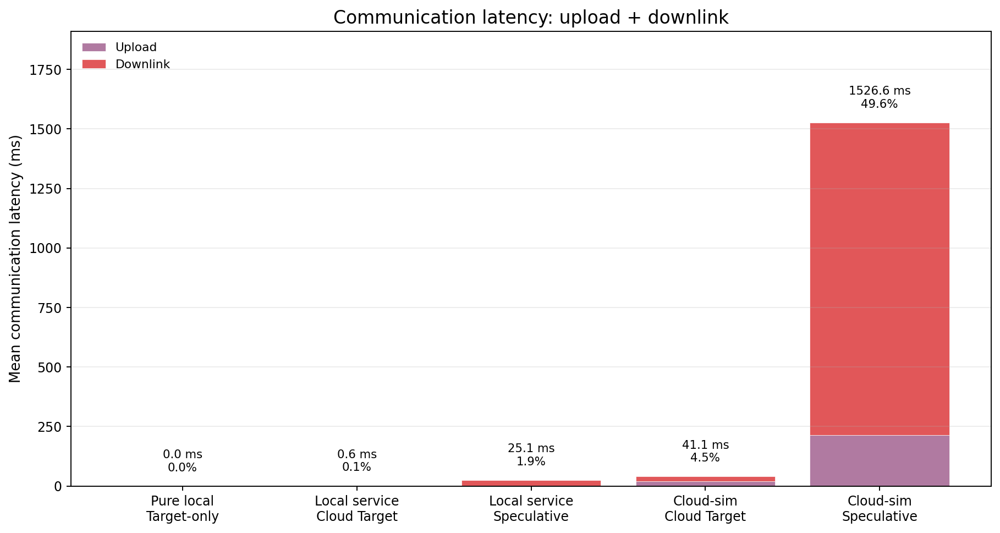
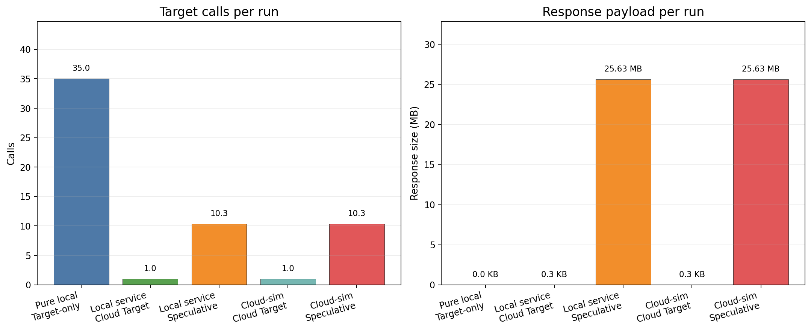

# Edge-cloud Speculative Decoding 时间分布组会汇报

## 1. 汇报目标

本次重新设计实验，是为了把 baseline 改成更符合真实云端推理的形式：

> 端侧上传 prompt，云端 target 模型完整生成答案，端侧接收最终输出。

因此，之前“每生成一个 token 就 HTTP 请求一次 target”的 `target_ar` 不再作为主对比方法。它只保留为诊断模式，用来说明 per-token RTT 很低效，但不代表正常云端推理服务。

本报告关注的问题是：

- 正常云端 target-only 推理的时间分布是什么。
- 端云 speculative decoding 的时间分布是什么。
- upload/downlink 在模拟远端网络下占多少。
- 当前 speculative 为什么没有优于正常 cloud target-only baseline。

## 2. 推理任务和实验设置

本实验是**短文本自回归生成**延迟测试，不评估回答质量或准确率，只测端到端耗时和阶段占比。

默认 3 条 prompt：

| prompt id | prompt | 类型 |
|---:|---|---|
| 0 | `Explain speculative decoding in two concise paragraphs.` | 概念解释 |
| 1 | `Write a short Python function that computes Fibonacci numbers.` | 代码生成 |
| 2 | `Summarize why latency profiling matters for distributed inference.` | 技术总结 |

实验参数：

| 项目 | 设置 |
|---|---|
| Target model | `/home/chajiahao/data/hf_models/Qwen2.5-1.5B` |
| Drafter model | `/home/chajiahao/data/hf_models/Qwen2.5-0.5B` |
| 解码策略 | Greedy |
| `max_tokens` | 35 |
| `gamma` | 4 |
| chat template | 启用 |
| warmup | 每个 prompt/mode 1 次 |
| measured runs | 每个 prompt/mode 3 次，共 9 个样本 |
| 远端模拟 | RTT 40 ms，上行 100 Mbps，下行 200 Mbps |
| KV-cache | 本轮主结果 `use_cache=False` |

## 3. 对比方法

| 方法 | benchmark mode | 通信模式 | 作用 |
|---|---|---|---|
| Pure local Target-only | `local_target_ar` | 无 HTTP | 本地无网络理想基线。 |
| Local service Cloud Target | `cloud_target_generate` | 上传 prompt 一次，云端完整生成，下载最终 token ids 一次 | 正常云端 target-only baseline，本机服务化版本。 |
| Local service Speculative | `speculative` | 端侧 drafter，云端 target 分块 verify，返回 logits | 本机服务化端云 speculative。 |
| Cloud-sim Cloud Target | `cloud_target_generate --simulate-network` | 正常云端 baseline + RTT/带宽模拟 | 模拟远端云的 target-only baseline。 |
| Cloud-sim Speculative | `speculative --simulate-network` | 端云 speculative + RTT/带宽模拟 | 模拟远端云的 speculative。 |

`target_ar` 已降级为 diagnostic：它每 token 一次 HTTP，不再出现在主图和主结论中。

## 4. 代码实现

### 4.1 Target HTTP 服务

`serve_target.py` 现在有两个核心接口：

| 接口 | 用途 |
|---|---|
| `/forward` | 给 speculative 用：输入 prompt + draft block，返回验证所需 logits。 |
| `/generate` | 给正常 cloud target-only 用：输入 prompt，服务端完整生成答案，只返回最终 output token ids。 |

### 4.2 正常 Cloud Target-only 流程

这个流程符合常见云端 LLM 服务：端侧不会每个 token 请求一次云端，而是把生成循环放在云端。

### 4.3 Edge-cloud Speculative 流程

当前 speculative 的关键限制是：云端返回的是完整 vocab logits block。Qwen2.5 vocab 约 151936，float32 logits 很大，因此远端模拟下 downlink 成为主要瓶颈。

## 5. 总体结果

| 方法 | 平均总耗时 ms | P50 ms | P95 ms | 吞吐 tok/s | 平均生成 tokens |
|---|---:|---:|---:|---:|---:|
| Pure local Target-only | 858.07 | 857.30 | 879.03 | 40.80 | 35.00 |
| Local service Cloud Target | 903.97 | 909.43 | 949.07 | 38.77 | 35.00 |
| Local service Speculative | 1304.72 | 1316.27 | 1660.81 | 25.48 | 32.78 |
| Cloud-sim Cloud Target | 919.68 | 910.02 | 969.23 | 38.09 | 35.00 |
| Cloud-sim Speculative | 3075.09 | 3145.65 | 3784.40 | 10.69 | 32.78 |

关键结论：

- 正常 cloud target-only baseline 很强：local service 下只比纯本地慢约 `5.35%`。
- Local service speculative 比正常 cloud target-only 慢 `1.44x`。
- Cloud-sim speculative 比 Cloud-sim cloud target-only 慢 `3.34x`。
- 当前端云 speculative 的主要问题不是 target 调用次数，而是 drafter 开销和 logits 下行体积。

## 6. 阶段耗时分布

### 6.1 绝对耗时拆分

| 方法 | 主要阶段 | 解释 |
|---|---|---|
| Pure local Target-only | `target_forward` 833.49 ms | 几乎全是本地 target forward。 |
| Local service Cloud Target | `cloud_generate` 900.62 ms | 云端完整生成，HTTP 开销很小。 |
| Local service Speculative | drafter 759.36 ms + cloud verify 450.37 ms | drafter 和 verify 叠加后超过 cloud target-only。 |
| Cloud-sim Cloud Target | `cloud_generate` 875.37 ms + 通信 41.13 ms | 只上传 prompt、下载 token ids，通信占比小。 |
| Cloud-sim Speculative | drafter 1015.50 ms + downlink 1313.21 ms + upload 213.39 ms + verify 454.29 ms | 下行 logits 和 drafter 成为瓶颈。 |

### 6.2 阶段占比

| 方法 | 关键占比 |
|---|---|
| Pure local Target-only | target forward `97.14%` |
| Local service Cloud Target | cloud generate `99.63%` |
| Local service Speculative | drafter `58.20%`，cloud verify `34.52%` |
| Cloud-sim Cloud Target | cloud generate `95.18%`，通信 `4.47%` |
| Cloud-sim Speculative | downlink `42.70%`，drafter `33.02%`，cloud verify `14.77%`，upload `6.94%` |

## 7. 端云通信分析

| 方法 | upload ms | downlink ms | upload+downlink ms | 通信占比 |
|---|---:|---:|---:|---:|
| Pure local Target-only | 0.00 | 0.00 | 0.00 | 0.00% |
| Local service Cloud Target | 0.47 | 0.16 | 0.63 | 0.07% |
| Local service Speculative | 2.51 | 22.61 | 25.12 | 1.93% |
| Cloud-sim Cloud Target | 20.77 | 20.36 | 41.13 | 4.47% |
| Cloud-sim Speculative | 213.39 | 1313.21 | 1526.61 | 49.64% |

正常 cloud target-only 的通信很小，因为只传一次 prompt 和一次最终 token ids。相反，当前 speculative 需要多次传输 verify logits，导致模拟远端时通信占接近一半。

## 8. 调用次数和响应体积

| 方法 | target 调用次数/run | 平均请求体积/run | 平均响应体积/run |
|---|---:|---:|---:|
| Pure local Target-only | 35 local forwards | 0 B | 0 B |
| Local/Cloud-sim Cloud Target | 1 HTTP call | 252 B | 276 B |
| Local/Cloud-sim Speculative | 10.33 HTTP calls | 3.7 KB | 25.63 MB |

这张表解释了为什么新的合理 baseline 下 speculative 不占优：

- Cloud Target-only：云端生成完整答案，只返回最终 token ids，响应体积极小。
- Speculative：云端返回完整 vocab logits，单次响应大，多次响应累计约 `25.63 MB/run`。
- 在 cloud-sim 下，25.63 MB 的下行传输直接变成 `1313.21 ms` 平均 downlink。

## 9. 为什么当前 speculative 没有更快

### 9.1 和正常 Cloud Target-only 比，baseline 更合理也更强

之前 per-token HTTP target-only 慢，是因为每 token 都要走一次 RTT。现在 `/generate` 把生成循环放在云端，只需一次请求，所以它才是正常云端 baseline。

在这个合理 baseline 下：

- Local service Cloud Target：`903.97 ms`
- Local service Speculative：`1304.72 ms`

即使没有远端网络，speculative 也慢 `1.44x`，因为 drafter 本身花了 `759.36 ms`，再加 cloud verify `450.37 ms`，已经超过 cloud target 完整生成时间。

### 9.2 远端模拟下，完整 logits 下行是最大问题

Cloud-sim 下：

- Cloud Target-only 通信：`41.13 ms`，占 `4.47%`
- Speculative 通信：`1526.61 ms`，占 `49.64%`

根本原因是两者返回内容不同：

- Cloud Target-only 返回最终 token ids。
- Speculative 返回完整 vocab logits block。

因此，在当前协议下，端云 speculative 的收益被 logits 下行成本抵消。

### 9.3 当前 target 模型较小，speculative 的收益空间有限

本实验 target 是 Qwen2.5-1.5B，35 tokens 的完整云端生成约 `900 ms`。目标模型本身还不够慢，drafter + verify + 通信额外开销很容易超过它。

如果换成更大的 target 模型、更长生成、更慢云端计算，speculative 的计算节省才可能更明显。但前提是先解决下行 logits 体积。

## 10. 结论

1. **新的 Cloud Target-only baseline 更合理。** 它一次上传 prompt、云端完整生成、一次返回答案，符合正常云端推理服务。
2. **当前 speculative 没有优于正常 Cloud Target-only。** Local service 下慢 `1.44x`，cloud-sim 下慢 `3.34x`。
3. **Cloud-sim Speculative 的最大瓶颈是下行。** Downlink 平均 `1313.21 ms`，占总耗时 `42.70%`。
4. **通信体积差异非常大。** Cloud Target-only 返回约 `276 B/run`，Speculative 返回约 `25.63 MB/run`。
5. **后续优化方向应从协议设计开始。** 不能让端侧接收完整 vocab logits，否则远端场景很难赢。

## 11. 后续改进方向

优先级最高的改进：

1. **服务端完成 acceptance/verification，只返回 accepted tokens。** 这样可以避免完整 logits 下行。
2. **减少 logits 返回体积。** 例如 float16、top-k logits、只返回 draft token 概率、压缩编码。
3. **增加 `/speculative_step` 服务端接口。** 客户端上传 draft tokens，服务端返回接受长度和必要 token，而不是完整 logits。
4. **启用 target KV-cache。** `/generate` 和 speculative verify 都应支持缓存，减少重复 forward。
5. **扫描更长输出和更大 target。** 当前 1.5B/35 tokens 场景太短，speculative 计算收益不明显。
6. **做真实双机或 `tc/netem` 实验。** 当前 cloud-sim 是代码级 sleep，不代表完整公网链路。

