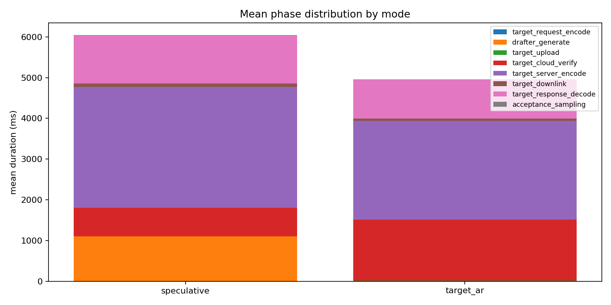
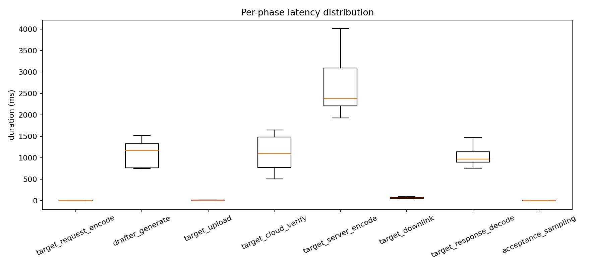

# Speculative Decoding 推理全流程时间占比组会汇报

## 1. 汇报目标

本次实验目标不是单纯验证 speculative decoding 是否端到端加速，而是测量一次推理过程中各阶段的耗时和占比，尤其关注端云通信链路中的：

- 客户端请求编码时间
- 上行发送时间
- 云端验证时间
- 服务端响应编码时间
- 下行读取时间
- 客户端响应解析时间

实验采用单机模拟端云架构：客户端和云端 target 服务部署在同一台服务器上，通过 `127.0.0.1:8000` HTTP 通信。这样可以稳定拆分推理链路阶段，但这里的 upload/downlink 是 localhost 传输时间，不代表公网链路时延。

## 2. 方法实现

### 2.1 系统结构

本项目在原始 speculative decoding 代码上增加了一个本地 target 服务和 benchmark 客户端。

核心模块如下：

- `serve_target.py`：加载 target model，启动 HTTP 服务，提供 `/health`、`/metadata`、`/forward`。
- `remote_target.py`：客户端侧远程 target wrapper，负责发送 `/forward` 请求并记录通信阶段耗时。
- `sampling/model_call.py`：统一封装 local model 和 remote target model 调用。
- `sampling/speculative_decoding.py`：在 speculative decoding 主循环中加入可选 profiling。
- `sampling/base_decoding.py`：在 target autoregressive decoding 中加入可选 profiling。
- `benchmark.py`：非交互式实验入口，执行 warmup、正式测量、输出 CSV/JSONL/PNG。
- `profiling.py`：统一记录事件、汇总统计、写出结果文件。

### 2.2 代码流程

Target 服务端流程：

1. `serve_target.py` 加载本地 target model。
2. 客户端调用 `/forward`，请求体包含 `input_ids`、`logits_start`、`logits_end`。
3. 服务端将输入转换成 CUDA tensor。
4. 调用 target model forward。
5. 截取本轮需要返回的 logits window。
6. 将 logits 转到 CPU 并转成 Python list。
7. 用 JSON 序列化 response。
8. 通过 HTTP 返回给客户端。

客户端 benchmark 流程：

1. `benchmark.py` 初始化 tokenizer、drafter model 和 `RemoteTargetModel`。
2. 每条 prompt 先进行 warmup，再进行正式测量。
3. speculative 模式执行：
   - 初始 target 调用。
   - drafter 本地生成 `gamma` 个候选 token。
   - target 服务端验证 draft tokens。
   - 客户端执行 acceptance sampling。
4. target AR 模式执行：
   - 每生成一个 token 都调用一次远程 target。
5. 每次 target HTTP 调用记录通信和服务端阶段耗时。
6. 输出 `raw_events.jsonl`、`run_summary.csv`、`aggregate_summary.csv` 和图表。

## 3. 时间拆分口径

需要特别注意：部分指标是客户端观测值，部分指标是服务端内部指标，二者存在包含关系。

客户端观测的 HTTP 调用口径：

- `target_request_encode`：客户端将请求 JSON 编码成 bytes 的时间。
- `target_upload`：客户端发送 HTTP headers 和 body 的时间。
- `target_response_wait`：客户端等待服务端返回 headers 的时间。它包含云端验证、服务端响应编码以及少量调度/等待开销。
- `target_downlink`：客户端读取 response body 的时间。
- `target_response_decode`：客户端 `json.loads` 解析 response body 的时间。

服务端内部口径：

- `target_model_forward`：target model forward 时间。
- `target_cloud_verify`：云端验证总时间，包含 target forward、logits window 截取、CPU 转移和 `tolist`。
- `target_server_encode`：服务端将 logits response 序列化为 JSON 的时间。

因此，做阶段占比时不能把 `target_response_wait` 和 `target_cloud_verify`、`target_server_encode` 重复相加。本报告的阶段占比使用如下不重叠拆分：

`generation_total = client_encode + upload + cloud_verify + server_encode + server_other + downlink + client_decode + local_compute + other_local`

其中：

`server_other = target_response_wait - target_cloud_verify - target_server_encode`

## 4. 实验设计

### 4.1 模型与部署

- Target model：`/home/chajiahao/data/hf_models/Qwen2.5-1.5B`
- Drafter model：`/home/chajiahao/data/hf_models/Qwen2.5-0.5B`
- Tokenizer：target model tokenizer
- Target 服务地址：`http://127.0.0.1:8000`
- 运行环境：Conda 环境 `specd`
- 加载方式：本地离线加载，`--local-files-only`

启动 target 服务：

```bash
export HF_HUB_OFFLINE=1
export TRANSFORMERS_OFFLINE=1

python serve_target.py \
  --model /home/chajiahao/data/hf_models/Qwen2.5-1.5B \
  --device cuda \
  --local-files-only
```

运行 benchmark：

```bash
python benchmark.py \
  --target-url http://127.0.0.1:8000 \
  --drafter-model /home/chajiahao/data/hf_models/Qwen2.5-0.5B \
  --tokenizer /home/chajiahao/data/hf_models/Qwen2.5-1.5B \
  --modes speculative,target_ar \
  --local-files-only \
  --output-dir results
```

### 4.2 实验参数

| 参数 | 数值 |
|---|---:|
| modes | `speculative,target_ar` |
| gamma | 4 |
| max generated tokens | 35 |
| prompts | 3 |
| warmup runs | 每个 prompt/mode 1 次 |
| measured runs | 每个 prompt/mode 3 次 |
| measured samples | 每个 mode 9 次 |
| prompt tokens | 平均 29 |
| response format | JSON logits |

## 5. 实验输出

结果文件位于 `results/`：

- `results/raw_events.jsonl`：逐事件 trace。
- `results/run_summary.csv`：每次 run 的阶段汇总。
- `results/aggregate_summary.csv`：按 mode 聚合的 mean、p50、p95、std。
- `results/phase_stacked.png`：阶段耗时堆叠图。
- `results/phase_boxplot.png`：阶段耗时箱线图。

图表：





## 6. 实验结果

### 6.1 总体耗时

| 模式 | 样本数 | 平均总耗时 | P50 总耗时 | 平均吞吐 |
|---|---:|---:|---:|---:|
| speculative | 9 | 6763.84 ms | 7224.99 ms | 5.60 tokens/s |
| target_ar | 9 | 5642.71 ms | 5453.36 ms | 6.24 tokens/s |

### 6.2 Speculative 全阶段耗时与占比

| 阶段 | 平均耗时 | P50 | 占总耗时 |
|---|---:|---:|---:|
| client request encode | 0.66 ms | 0.72 ms | 0.01% |
| 上行 upload/send | 4.93 ms | 4.98 ms | 0.07% |
| 云端验证 cloud verify | 695.52 ms | 776.59 ms | 10.28% |
| 服务端 response encode | 2970.89 ms | 3207.24 ms | 43.92% |
| 服务端其它等待 | 24.22 ms | 22.09 ms | 0.36% |
| 下行 downlink/read | 81.90 ms | 84.44 ms | 1.21% |
| client JSON decode | 1182.28 ms | 1148.25 ms | 17.48% |
| 本地 drafter | 1102.09 ms | 1170.13 ms | 16.29% |
| acceptance sampling | 5.28 ms | 4.40 ms | 0.08% |
| 其它本地开销 | 696.07 ms | 680.71 ms | 10.29% |

补充：`target_model_forward` 平均为 451.57 ms，占总耗时 6.68%。它包含在 `cloud verify` 中，不应重复相加。

### 6.3 Target AR 全阶段耗时与占比

| 阶段 | 平均耗时 | P50 | 占总耗时 |
|---|---:|---:|---:|
| client request encode | 2.25 ms | 2.11 ms | 0.04% |
| 上行 upload/send | 15.15 ms | 15.91 ms | 0.27% |
| 云端验证 cloud verify | 1495.02 ms | 1489.60 ms | 26.49% |
| 服务端 response encode | 2424.35 ms | 2355.39 ms | 42.96% |
| 服务端其它等待 | 66.08 ms | 65.58 ms | 1.17% |
| 下行 downlink/read | 54.92 ms | 54.30 ms | 0.97% |
| client JSON decode | 969.50 ms | 958.11 ms | 17.18% |
| 其它本地开销 | 615.44 ms | 583.06 ms | 10.91% |

补充：`target_model_forward` 平均为 1390.06 ms，占总耗时 24.63%。它包含在 `cloud verify` 中。

### 6.4 端云通信相关结果

如果只看纯粹网络读写：

| 模式 | upload + downlink | 占总耗时 |
|---|---:|---:|
| speculative | 86.83 ms | 1.28% |
| target_ar | 70.08 ms | 1.24% |

如果把通信协议带来的序列化/反序列化也计入端云通信相关开销：

| 模式 | server encode | client decode | encode/decode 合计占比 |
|---|---:|---:|---:|
| speculative | 2970.89 ms | 1182.28 ms | 61.40% |
| target_ar | 2424.35 ms | 969.50 ms | 60.14% |

这说明当前链路里，网络传输本身不是主导瓶颈，主要瓶颈来自 logits 的 JSON 序列化和 JSON 解析。

### 6.5 按 HTTP 调用类型拆分

| 模式 | 调用类型 | 调用次数 | 平均 HTTP 总耗时 | 平均 upload | 平均等待 headers | 平均 downlink | 平均 client decode | 平均响应大小 |
|---|---|---:|---:|---:|---:|---:|---:|---:|
| speculative | initial | 9 | 93.38 ms | 0.34 ms | 91.45 ms | 1.57 ms | 27.97 ms | 1.33 MB |
| speculative | verify | 101 | 328.32 ms | 0.41 ms | 320.72 ms | 7.16 ms | 102.86 ms | 6.17 MB |
| target_ar | autoregressive | 315 | 115.90 ms | 0.43 ms | 113.87 ms | 1.57 ms | 27.70 ms | 1.34 MB |

Speculative verify 一次返回多个 token 的 logits，因此平均响应大小达到 6.17 MB，是 target AR 单 token 响应的约 4.6 倍。

### 6.6 Acceptance rate

| 指标 | 数值 |
|---|---:|
| acceptance rate mean | 0.604 |
| acceptance rate P50 | 0.489 |
| 平均 accepted drafts | 22.78 |
| 平均 speculated drafts | 39.67 |

Acceptance rate 处于中等水平。本次报告重点不是加速比，但该指标会影响 speculative verify 调用次数和本地 drafter 开销。

## 7. 实验结果分析

### 7.1 当前推理时间的主要组成

Speculative 模式中，前三大耗时来源是：

1. 服务端 response encode：43.92%
2. client JSON decode：17.48%
3. 本地 drafter：16.29%

Target AR 模式中，前三大耗时来源是：

1. 服务端 response encode：42.96%
2. 云端验证 cloud verify：26.49%
3. client JSON decode：17.18%

两个模式都显示：当前端云协议的编码/解析成本非常高，已经超过模型 forward 本身。

### 7.2 端云通信的关键观察

传统意义上的上行和下行网络传输只占约 1.2% 到 1.3%。但是端云通信不能只看 socket 读写，因为跨进程/跨端传输 logits 还包含：

- 服务端把 tensor 转 CPU/list 的准备成本。
- 服务端 JSON 序列化成本。
- 客户端 JSON 解析成本。
- 客户端将解析后的数据重新变成 tensor 的成本。

本次代码已经测到 JSON 序列化和 JSON 解析，但客户端 tensor materialization 还没有单独计时，可能被计入其它本地开销。

### 7.3 为什么 speculative 的 response 更大

Target AR 每次只需要返回最后一个 token 的 vocab logits，响应约 1.34 MB。

Speculative verify 一次需要返回多个位置的 vocab logits，平均响应约 6.17 MB。由于 Qwen tokenizer vocab size 为 151936，完整 logits 的传输体积非常大。当前使用 JSON float list 表示 logits，会进一步放大序列化和解析成本。

### 7.4 对实验目标的结论

从“推理过程中所有时间占比”的角度看，本次结果说明：

- 云端模型 forward 不是唯一主要耗时。
- 端云通信相关的软件协议开销是主导项。
- 如果继续使用 JSON 返回完整 vocab logits，端云协同 speculative decoding 的时间分布会被序列化/解析主导。
- 要准确评估真实端云系统，需要把通信协议设计作为实验变量，而不仅仅统计模型计算时间。

## 8. 当前实验的局限

1. 客户端和服务端运行在同一台服务器，upload/downlink 是 localhost 时间，不代表公网或无线网络。
2. HTTP response 使用 JSON 格式，和真实高性能推理 RPC 不完全一致。
3. 当前返回完整 vocab logits，没有做 top-k 压缩、量化或二进制传输。
4. `client_response_decode` 只统计 JSON parse，未单独统计 `torch.tensor` materialization。
5. GPU 型号、显存状态、并发负载等系统信息尚未写入结果文件。
6. KV cache 在 remote target benchmark 中关闭，和生产推理系统仍有差异。

## 9. 后续计划

优先建议继续围绕端云通信拆分做实验：

1. 增加客户端 tensor materialization 计时。
2. 将 response 从 JSON 改成二进制 logits，例如 float16 bytes 或 `.npy` payload。
3. 对比 JSON float32、binary float32、binary float16 三种协议的阶段占比。
4. 增加 response size、tokens per verify、logits positions 等字段到 run summary。
5. 在不同网络条件下重复实验，例如 localhost、局域网、真实端云链路。
6. 增加 GPU 型号、CUDA 版本、显存占用、模型 dtype 到实验元数据。
7. 扫描 `gamma`，观察 acceptance rate、verify 响应大小和阶段占比之间的关系。

## 10. 组会可以强调的结论

本次实验完成了 speculative decoding 端云推理链路的阶段化计时。结果显示，在当前实现中，纯网络 upload/downlink 只占约 1.3%，但通信协议相关的服务端 JSON 编码和客户端 JSON 解析占比超过 60%。因此，端云 speculative decoding 的主要优化方向不只是减少 target forward 次数，还需要优化 logits 的跨端传输表示和解析方式。
